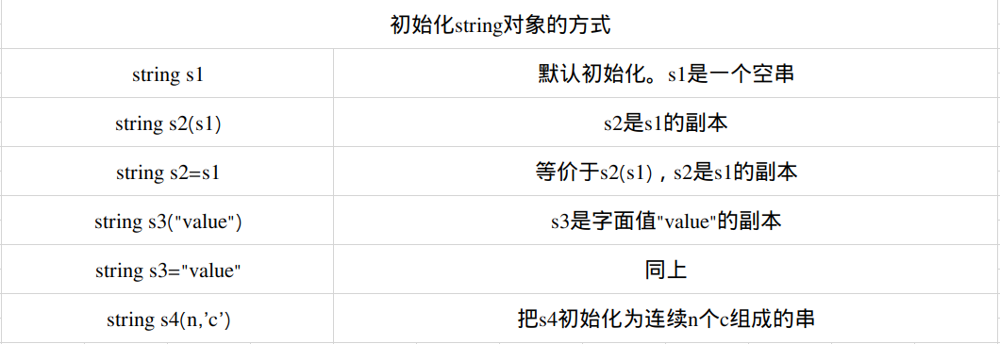

# C++ Primer Chapter3:字符串、向量和数组3.1-3.2

## 命名空间的using声明
* 目前为止，我们遇到的库函数基本上都属于命名空间std，而程序也显示地将这一点标示了出来。使用作用域操作符的含义是：编译器应从左侧的所示的作用域中寻找右侧那个名字。
* 通过更简单的途径也能使用到命名空间中的成员。就是使用`using声明(using declaration)`。
* using声明具有形式：`using namespace::name`；

        #include<iostream>
        //using声明，当我们使用名字cin时，从命名空间std中获取它。
        using std::cin;

        int main()
        {
            int i;
            cin>>i;//正确：cin和std::cin含义相同
            cout<<i;错误：没有对应的using声明，必须使用完整的名字。
            std::cout<<i;//正确显式地从std中使用cout
        }

### 每个名字都需要独立的using声明
* 每个using声明引入命名空间中的一个成员。例如，可以把要用到的标准库中的名字都以using声明的形式表示出来，重写的程序如下：

        #include<iostream>
        //通过下列using声明，我们可以使用标准库中的名字
        using std::cin;using std::cout;using std::endl;
        int main()
        {
            cout<<"Enter Two Numbers"<<endl;
            int v1,v2;
            cin>>v1>>v2;
            cout<<"The Sum Of"<<v1<<"and"<<v2<<"is"<<v1+v2<<endl;
            return 0;
        }

### 头文件不应包含using声明
* 位于头文件的代码一般来说不应该使用using声明。这是因为头文件的内容会拷贝到所有引用它的文件中去，如果头文件中有某个using声明，那么每个包含了这个头文件的文件都具有这个声明。对于某些程序来说。可能产生名字冲突。

### 一些注意事项
* 之后将假设用到的标准库中的名字都已将using声明过了，将直接在代码中使用cin或cout

## 标准库类型string
* 标准库类型string表示可变长的字符序列，使用string类型必须首先包含string头文件。string定义在命名空间std中。

        #include<string>
        using std::string;
* c++标准一方面对库类型所提供的类型进行了详细规定，另一方面也对库的实现者做出一些性能上的要求。因此，标准库类型对于一般应用场景来说有足够的效率。

### 定义和初始化string对象
* 如何初始化类的对象是由类决定的。一个类可以定义很多初始化对象的方式，只不过这些方式之间必须有所区别。或者是初始值的类型不同更或者是初始值的数量不同。

        string s1;//默认初始化。s1是个空字符串
        string s2=s1;//s2是s1的副本
        string s3="hiya";//s3是该字符穿字面值的副本
        string s4(10,'c');//s4的内容是cccccccccc

### 直接初始化和拷贝初始化
* 如果使用等号(=)初始化一个变量，实际上执行的是`拷贝初始化(copy initialization)`，编译器把等号右侧的初始值拷贝到新创建的对象中去，与之相反如果不使用等号，则执行的是`直接初始化(direct initialization)`。
* 当初始值只有一个时，使用直接初始化或者拷贝初始化都行。如果像上面s4那样初始化要用到的值有多个，一般来说只能用直接初始化的方式：

        string s5="hiya";//拷贝初始化
        string s6("hiya");//直接初始化
        string s7=(10.'c');//直接初始化

* 对于用多个值进行初始化的情况，非要用拷贝初始化的方式来处理也不是不可以，不过需要显式地穿件一个（临时）对象用于拷贝。

        string s8=string(10.'c');//拷贝初始化，s8的内容是cccccccccc

* 这条语句本质上等价于下面两条语句：

        string temp(10,'c');
        string s8=temp;//将temp拷给s8

* 尽管初始化s8的语句合法，但是可读性差，也没有任何优势。

## string对象上的操作
* 一个类除了要规定初始化其对象的方式外，还要定义对象上所能执行的操作。其中，类既能定义通过函数名调用的操作，也能定义<<、+等各种运算符在该类对象上的新含义。

### 读写string对象
* 使用标准库中的iostream来读写int、double等内置类型的值。同样，也可以使用IO操作符读写string对象。：

        int main()
        {
            string s;//空字符串
            cin>>s;//将string对象读入s，遇到空白停止
            cout<<s<<endl;//输出s
            return 0;
        }

* 在执行读取操作时，string对象会自动忽略开头的空白（即空白符、换行符、制表符等）并从第一个真正的字符开始读起。直到遇到下一个空白为止。如果输入"Hello Word",则程序只能读到"Hello".
* 和内置类型的输入输出操作一样，string对象的此类操作也是返回运算符左侧的运算对象作为结果。因此，多个输出或者多个输入可以连续写在一起。

        string s1,s2;
        cin>>s1>>s2;//把第一个输入读到s1中，第二个输入读到s2中
        cout<<s1<<s2<<endl;//输出两个string对象

* 如果输入“Hello World!”,则输出为“HelloWorld！”。

### 读取未知数量的string对象
* 编写一个程序用于读取string对象：

        int main()
        {
            string word;
            while(cin>>word)
            {
                cout<<word<<endl;
            }
            return 0;
        }

* while中的条件用于在读取时检测流的情况，如果流有效，也就是说没遇到文件结束标志或者非法输入。

### 使用getline读取一整行
* 有时我们希望在最终得到的字符串中保留空白符，这是应该用`getline`函数来代替原来的>>运算符。getline函数的参数是一个输入流和string对象，函数从给定的输入流中读取内容，直到遇到换行符位置（换行符也会被读入），然后把独到的内容存入那个string对象（不存换行符），如果输入一开始是个换行符，那么所得的结果是空string。
* 和输入运算符一样，getline也会返回他的流参数。因此既然输入运算符能作为判断的条件。我们能改写程序令它一次输出一整行。

        int mian()
        {
            string line;
            //每次读入一整行，直至到达文件末尾
            while(getline(cin,line))
            {
                cout<<line<<endl;
                return 0;
            }
        }

* 因为line中不包含换行符，所以我们手动加上换行操作符。和往常一样，使用endl结束当前行并刷新显示缓冲区。
* 出发getline返回的那个换行符实际上被丢弃掉了，得到的string对象中并不包含该换行符。

### string的empty和size操作。
* `empty`函数根据string对象是否为空返回一个对应的布尔值。empty也是string的一个成员函数。调用该函数的方法很简单，只要用点操作符指明是那个对象执行了empty函数就可以了。
* 通过该写之前的程序，可以做到只输出非空的行：

        //每次读入一整行，遇到空行直接跳过
        while(getline(cin,line))
        {
            if(!line.empty())
            {
                cout<<line<<enld;
            }
        }
* 在上面的程序中if语句的条件部分使用了`逻辑非运算符(!)`,它返回与其运算对象相反的结果。此例中，如果str不为空，则返回真。
* `size`函数返回string对象的长度（即string对象中字符的个数），可以使用size函数只输出长度超过80字符的行：

        string line;
        //每次读入一整行，输出其中超过80个字符的行
        while(getline(cin,line))
        {
            if(line.size()>80)
            {
                cout<<line<<endl;
            }
        }
