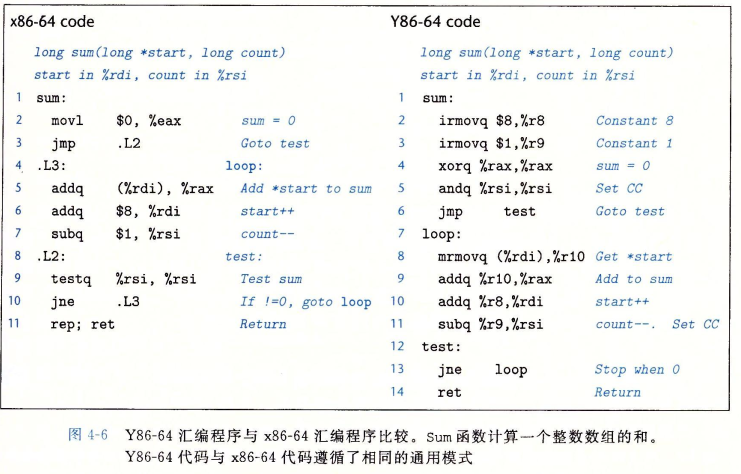

# Y86-64指令集体系结构
* 定义一个指令集体系结构包括定义各种状态单元、指令集和他们的编码、一组变成规范和异常事件处理。
* Y86程序中的每条指令都会读取或修改处理器状态的某些部分。这成为程序员可见状态，“程序员”既可以是用汇编代码写程序员的人，也可以是产生机器级代码的编译器。在处理器实现中，只要我们保证机器级程序能够访问程序员可见状态，就不需要完全按照ISA暗示的方式来表示和组织这个处理器状态。Y86的状态类似于X86，。有15个程序寄存器：%rax、%rcx、%rdx、%rbx、%rsp、%rbp、%rsi、%rdi和%r8到%r14.每个程序寄存器存储一个64位的字。寄存器%rsp被入栈、出栈、调用和返回指令作为栈指针。除此之外，寄存器没有固定的含义或固定值。有3个一味地条件码：ZF、SF和OF，他们保存着最近的算术或逻辑指令所造成影响的有关信息。程序计数器（PC）存放当前正在执行指令的地址。
* 内存从概念上来说就是一个很大的字节数组，保存着程序和数据。Y86程序用虚拟地址来引用内存位置。硬件和操作系统软件联合起来将虚拟地址翻译成实际或物理地址，指明数据实际存在内存中哪个地方。虚拟内存系统向Y86城西提供了一个单一的字节数组映像。
* 程序状态的最后一个部分是状态码stat，它表明程序执行的总体状态。它会指示是正常运行还是出现了某种异常，例如当一条指令试图去读非法的内存地址是。

## Y86_64指令
* 图中给出了Y86-64ISA中各个指令的简单描述。这个指令集就是我们处理器实现的目标。Y86指令集基本上是X86指令集的一个子集，他只包括8字节整数操作，寻址方式比较少，操作也比较少。因为我们只有8字节数据，所以称之为“字”不会有任何歧义。在途中，左边是指令的汇编码表示，右边是字节编码。汇编代码格式类似于X86的ATT格式
  * x86的movq指令分成了4个不同的指令：irmovq、rrmovq、mrmovq和rmmovq。分别显式地致命源和目的地格式。源可以是立即数(i)、寄存器（r）、或内存（m）。指令名字的第一个字母就表明了源的类型。目的可以是寄存器（r）或内存（m）。指令名字的第二个字母指明了目的地类型。在决定如何实现数据传送石，显示地指明数据传送的这4种类型是很有帮助的。两个内存传送指令中的内存引用方式是简单地基址和偏移量形式。在地址计算中，我们不支持第二变址寄存器和任何寄存器值的伸缩。同x86一样，我们不允许从一个内存地址直接传送到另一个内存地址。另外也不允许将立即数传送到内存。
  * 有四个整数操作指令，如OPq。他们是addq、subq、andq和xorq。他们只对寄存器数据进行操作，而x86还允许对内存数据进行这些操作。这些指令会设置3个条件码ZF、SF和OF（零、符号和溢出）。
  * 7个跳转指令是jmp、jle、jl、je、jne、jge和jg。根据分之指令的类型和条件代码的设置来选择分支。分分支条件和x86的一样
  * 有6个条件传送指令:cmovle、cmovl、cmove、cmovne、cmovge和cmovg。这些指令的格式和寄存器——寄存器传送指令rrmovq一样但是只有当条件码满足所需要的约束时，才会更新目的寄存器的值。
  * call指令将返回地址入栈，然后跳到目的地址。ret指令从这样的调用中返回。
  * pushq和popq指令实现了入栈和出栈，就像在x86中一样。
  * halt指令停止指令的执行。x86中有一个与之相当的指令hlt。x86的应用程序不允许使用这条指令，因为它会导致整个系统暂停运行。对于Y86来说，执行halt指令会导致处理器停止，并将状态吗设置为HLT。

## 指令编码
* 每条指令需要1~10个自己不等，这取决于需要那些字段。每条指令的第一个字节表明指令的类型。这个字节分为两个部分，每部分4为：高4位是代码部分，低4位是功能部分。代码值为0~0xB。工嗯呢个值只有在一组相关指令共用一个代码时操作有用。rrmovq与条件传送有同样的指令代码。可以把它看做是一个“无条件传送”，就好像jmp指令是无条件跳转一样，他们的功能代码都是0.
* 15个程序寄存器中每个都有一个相对应的范围在0到0xE之间的寄存器标识符，Y86中的寄存器编号跟x86中的相同。程序寄存器存在cpu中的一个寄存器文件中，这个寄存器文件就是一个小的、一寄存器ID作为地址的随机访问存储器。在指令编码中以及在我们的硬件设计中，当需要致命不应该访问任何寄存器是，就用ID值0xF来表示。
* 有的指令只有一个字节长，而有的需要操作数的指令编码就更长一些。首先，可能有附加的寄存器指示符字节，指定一个或两个寄存器。这些寄存器字段成为rA和rB。从指令的汇编代码表示中可以看到，根据指令类型，指令可以指定用于数据源和目的寄存器。或是用于地址计算的基址寄存器没有寄存器操作数的指令，例如分支指令和call指令，就没有寄存器指示符字节。那些只需要一个寄存器操作数的指令(irmovq、pushq和popq)将另一个寄存器指示符设为0xF。这种约定在我们的处理器视线中非常有用。
* 有些指令需要一个附加的4字节常熟字。这个字能作为irmovq的立即数数据，rmmovq和mrmovq的地址指示符的偏移量，以及分之指令个调用指令的目的地址。分支指令和调用指令的目的是一个绝对地址，而不像IA32中那样使用PC相对寻址方式。处理器使用PC相对寻址方式，分支指令的编码会更简洁，同事这样也能允许代码从内存中的一部分复制到另一部分而不需要更细你所有的分之目标地址。因为我们更关心描述的简单性，所以就是用了绝对寻址方式。因为我们更关心描述的简单性，所以就用了绝对寻址方式。同IA32一样，所有整数采用小端法编码。当指令按照反汇编格式书写时，这些字节就以相反的顺序出现。
* 指令集的一个重要性质就是字节编码必须有唯一的解释。任意一个字节序列要么是一个唯一的指令序列的编码，要么就不是一个合法的字节序列。Y86就具有这个性质，因为每一奥指令的第一个字节有位移的代码和功能组合，给定这个字节，我们就可以决定所有其他富家子节的长度和含义。这个性质保证了处理器可以无二义性地执行目标代码程序。几十代码嵌入在程序的其他字节中，只要序列的第一个字节开始处理，我们仍然可以很容易的确定指令序列，反过来说，如果不知道一段代码序列的其实位置，我们就不能准确地确定怎样将序列划分成单独的指令，对于试图直接从目标代码字节序列中抽取出及其级程序的反汇编程序和其他一些工具来说，这就带来了问题。

## Y86-64异常
* 对于Y86来说，程序员可见的状态Stat，它描述程序执行的总提状态。代码值1，命名为AOK，表示程序执行正常，而其他一些代码则表示发生了某种类型的异常。代码值2，命名为HLT，表示处理器执行了一条halt指令。代码3，命名为ADR，表示处理器试图从一个非法内存地址读或者想一个非法内存地址写，可能是当取指令的时候，也可能是当读或写数据的时候。我们会限制最大的地址，任何访问超出这个限定值得地址都会引发ADR异常。代码值4命名为INS，表示遇到了非法的指令代码。
* 对于Y86，当遇到这些异常的时候，我们就简单的让处理器停止执行指令。在更完整的设计中，处理器通常会调用一个异常处理程序，这个过程被指定用来处理遇到的某种类型的异常。异常处理程序可以被配置成不同的结果，例如，终止程序或者调用一个用户自定义的信号处理程序。

## Y86-64程序
* 图中给出了下面c函数的汇编代码

        long sum(long *start,long count)
        {
            long sum=0;
            while(count)
            {
                sum += *start;
                start++;
                count--
            }
            return sum;
        }

* x86代码是由GCC编译器产生的。Y86代码与之相似，但有一下不同点：
  * Y86将常数加载到寄存器，因为它在算术指令中不能使用立即数。
  * 要实现从内存读取一个数值并将其与一个寄存器相加，Y86代码需要两条指令，而x86只需要一条addq指令。
  * 我们手工编写的Y86实现有一个有事，即subq指令同时还设置了条件码，因此GCC生成代码中的testq指令就不是必须的。不过为此，Y86代码必须使用andq指令在进入循环之前设置条件码。

## Y86-64详情
* 大多数Y86指令是以一种直接明了的方式修改程序状态的，所以定义每条指令想要达到的结果并不困难。不过，两个特别指令的组合需要特别注意一下。
* pushq指令会把栈指针减8，并且将一个寄存器值写入内存中。因此，当执行pushq %rsp指令时，处理器的行为是不确定的，因为要入栈的寄存器会被桶一条指令修改。通常有两种不同的约定：（1）压入%rsp的原始值（2）压入减去8的%rsp的值。