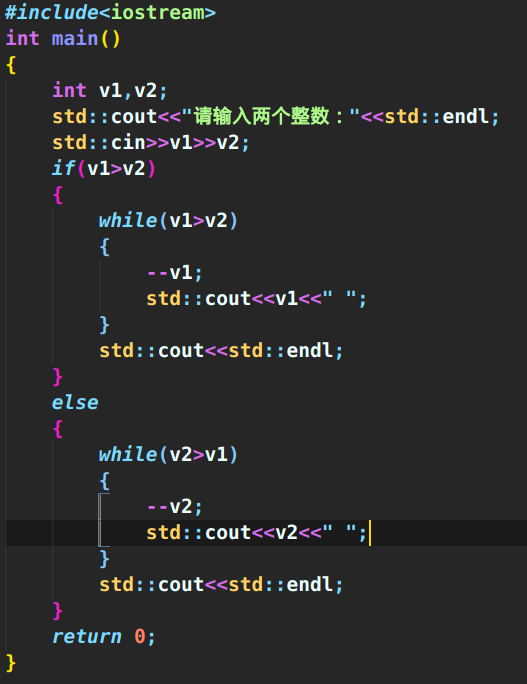
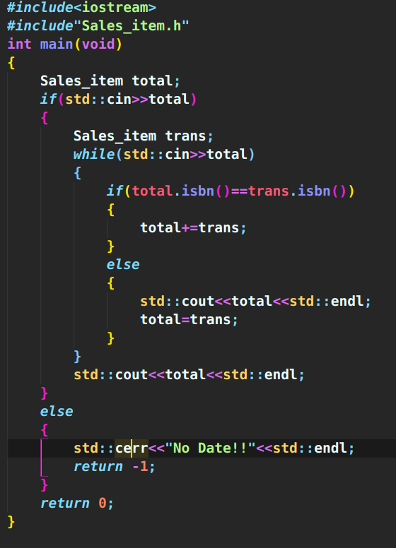

# C++ Primer Chapter 1:Starting
### 函数定义
* 一个程序包含一个或多个函数，有且只有一个main函数。
* 一个函数包含四部分
  * 返回类型
  * 函数名
  * 形参
  * 函数体

        int main()
        {
            return 0;
        }
* 这是一个简单地main函数，int为其返回类型，main为函数名，括号中的为形参（可以为空），花括号{}中的内容为函数体

### 输入输出
* c++使用标准库来提供IO机制，通常用到iostream库，需要在引入头文件：`#include<iostream>`.
* endl为操纵符，效果：结束当行。将于设备关联的缓冲区中内容刷到设备中，保证目前程序所产生的输出真正的写入到输出流中。
* 需要通过命名空间<namespae>才可以使用标准库中的一个名字，也就是说必须显式说明我们要使用来自命名空间std中的名字、有两种实现方式：
  * 使用作用域运算符：：如：std::cin(输入)、std::cout(输出)；
  * 在程序首部声明命名空间`using name std`,使用后即可不用作用于运算符进行前缀，直接写cin、cout。

### while和for控制流
* while

        while(condition)
        {
            statement;
        }
* for

        for(init-statement;condition;expression)
        {

        }
* c++中`init-statement`是for循环的一部分。

### 类
* 在c++中，我们通过定义一个类(class)来定义自己的数据结构，一个类定义了一个类型，以及与其相关的一组操作。类机制是c++最重要的特性之一。c++最初的一个设计焦点就是能定义使用上想内置类型一样自然地类类型。

### 输出10到0(while循环)

### 输出两个整数之间的所有整数

### 书店程序

* [书店程序头文件下载网址](http://www.informit.com/title/0321714113)