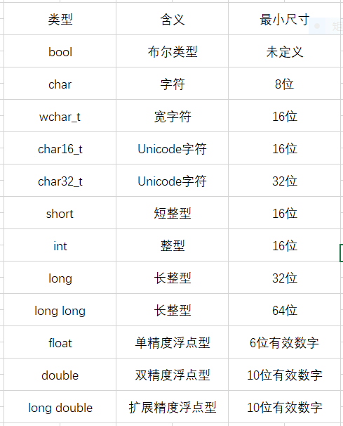

# C++ Primer Chapter 2:变量和基本类型
## 基本内置类型
* C++定义了一套包括基本类型和空类型在内的基本数据类型。其中算术基本类型包括了字符、整形数、布尔值和浮点数。空类型不对应具体的值，仅用于一些特殊的场合。

### 算术类型
* 算数类型分为两类：整型(intergral type,包括字符型和布尔型在内)和浮点型。
* 算数类型的尺寸在不同的机器上有区别。

* 表中列出了c++标准规定的尺寸的最小值，同时允许编译器赋予这些类型更大的尺寸，某一类型所占的比特数不同，所能表示的数据范围也不一样。

### 带符号类型和无符号类型
* 出去布尔型和扩展的字符型以外，其它整型可以分为`带符号(signed)`的和`无符号(unsigned)`的，带符号整型可以表示正数、负数和0。无符号整型则只能表示大于等于0的整数。

### 类型转换
* 类型所能表示的值的范围决定了转换的过程。
  * 当我们把一个非布尔类型的算数值赋给布尔类型时，初始值位0则结果位false，否则结果位true。
  * 当我们把一个布尔值付给非布尔类型时，初始值位false则结果为0，初始值为1rue则结果为1.
  * 当我们把一个浮点数赋给整数类型时，进行了近似处理。结果值将只保留小数点之前的部分。
  * 当我们把整数类型赋给浮点类型时，小数部分记为0。如果该整数所占空间超过了附带那类型的容量，精度可能会有所损失。
  * 当我们赋给无符号类型一个超出他所能表示范围的值时，结果是初始值对无符号类型所表示数值总数取模后的余数。
  * 当我们赋给带符号类型一个超出他表示范围的值时，结果是未定义(undefined)的。

### 切勿混用带符号类型和无符号类型
* 如果表达式里既有带符号类型又有无符号类型，当带符号类型取值为负时会出现异常结果，这是因为`带符号数会自动转换成无符号数`。

## 字面值常量
* 一个形如42的值被称作字面值常量(Literal)，这样的值一望而知。每个字面值常量都对应一种数据类型，字面值常量的形式和值决定了它的数据类型。

### 整型和浮点型字面值
* 我们可以将整型字面值写作十进制、八进制和十六进制的形式。整型字面值具体的数据类型由它的值和符号决定。尽管整形字面值可以存储在无符号数据类型中，十进制字面值不会时负数。
* 默认的。浮点型字面值时一个double。

### 字符和字符串字面值
* 有单引号括起来的一个字符称为char型字面值。双括号括起来的零个或多个字符则构成字符串型字面值。字符串字面值的类型实际上是由常量字符构成的数组(array)，编译器在每个字符串的结尾加上一个空字符('/0')，因此，字符串字面值的实际长度要比他的内容多1。
* 如果两个字符串字面值位置紧邻且由空格、缩进和换行符分隔。则它们实际上是一个整体。当书写的字符串字面值较长，就可以采取分开书写的形式：

        //分多行书写的字符串字面值
        std::cout<<"a really,really long string literay"
                   "that span two lines"<<std::endl;

### 转移序列
* 有两类字符程序员不能直接使用：一类是不可打印的(nonprintable)字符,如退格和其它控制字符，因为他们没有可视的图符；另一类实在c++语言中有特殊含义的字符，在这些情况下需要用到转义序列(escape sequence)。转义序列均以反斜杠为开始。

### 指定字面值的类型
* 通过添加前缀和后缀，可以改变整型、浮点型和字符型字面值的默认类型。
* 对于一个整型字面值来说，我们能分别指定它是否带符号以及占用多少空间。

### 布尔字面值和指针字面值
* true和false是布尔类型的字面值。
* nullptr是指针类型的字面值。

## 变量
* 变量提供一个具名的、可供程序操作的存储空间。c++中每个变量都有其数据类型，数据类型决定了变量所占内存空间的大小和布局方式。、该变量能存储的值的范围，以及变量能参与的运算。对c++程序员来说，"变量(vaiiable)"和"对象(object)"一般可以互换使用。

### 变量定义
* 变量定义的基本形式是：首先是类型说明符(type specifier)，随后紧跟由一个或多个变量名组成的列表，其中变量名以逗号分隔，最后以分号结束。列表中每个变量名的类型都由类型说明符指定，定义时还可以为一个或多个变量赋初值。

        何为对象？
        c++程序员在很多场合都会使用对象(object)这个名词，通常情况下，对象是指一块能存储数据并具有某种类型的内存空间。

### 初始值
* 当对象在创建时获得了一个特定的值，我们说这个值被初始化(initialized)了。用于初始化变量的值可以是任意复杂的表达式。当一次定义了两个或多个变量时，对象的名字随着定义也就马上可以使用了，因此在同意条定义语句中，可以用定义的变量的值去初始化后定义的其他变量。
* 在c++语言中，初始化和赋值是两个完全不同的操作。初始化不是赋值，初始化的含义是创建变量时赋予其一个初始值，而赋值的含义是把对象的当前值擦除，而已一个新值来代替。

### 列表初始化
* c++语言定义了初始化的好几种形式，这也是初始化问题复杂性的一个体现。作为c++11新标准的一部分，用花括号来初始化变量得到了全面的应用，这种初始化的形式叫做`列表初始化(list initialization)`，无论是初始化对象或是为对象赋新值，都可以使用这种形式。
* 当用于内置类型的变量时，如果我们使用列表初始化且初始值存在丢失风险，则编译器将报错。

### 默认初始化
* 如果定义变量是没有指定初值，则变量被默认初始化(defalt initialized)，此时变量被赋予“默认值”，默认值是什么由变量类型决定，定义变量的位置也对此有影响。
* 如果内置类型的变量未被显式初始化，他的值由定义的位置决定，定义于任何函数体制外的变量被初始化为0。一种例外情况是，定义在函数体内部的内置类型变量将`不被初始化(uninitialized)`。一个未被初始化的内置类型的值是未被定义的，如果试图拷贝或以其他形式访问此类值将引发错误。
* 每个类各自决定其初始化对象的方式，而且是否允许不经初始化就定义对象也由类决定。如果类决定允许这种行为，他将决定对象的初始值到底是什么。绝大多数类都支持无需显式初始化而定义对象，这样的类提供了一个合适的初始值。
* 定义域于函数体内的内置类型的对象如果没有初始化，则其值未定义。类的对象如果如果煤油显式地初始化，则其值由类决定。

## 变量声明和定义的关系
* `声明(declaration)`使得名字被程序所知。一个文件如果使用别处定义的名字则必须包含对那个名字的声明。而`定义(defination)`，负责创建与名字关联的实体。变量声明规定了变量的类型和名字，这一点与定义相同，但是除此之外，定义还申请内存空间，也可能为变量赋一个初始值。
* 如果想声明一个变量而非定义它，就在变量名前添加extern关键字，而且不要显式地初始化变量。
* 任何包含了显示初始化的声明即成为定义。给由extern关键字标记的变量赋值这一做法抵消了extern的作用，声明就变成了定义。
* `变量只能被定义一次，但可以被多次声明0`。

## 标识符
* c++的`标识符(identifier)`由字母、数字和下划线组成，其中必须以字母或下划线组成开头。标识符的长度没有限制，但是对大小写字母敏感。

### 变量命名规范
* 标识符要能体现实际含义
* 变量名一般用小写字母，如index，不要用Index或INDEX。
* 用户自定义的类名一般用大写字母开头，如Sales_item。
* 如果标识符由多个单词组成，则单词间应有明显区分。

## 名字的作用域
* `作用域(scope)`是程序的一部分，在其中名字有其特定的含义。c++语言中大多数作用于都已花括号分隔。
* 同一个名字在不同的作用域中可能指向不同的实体。名字的有效区域始于名字的声明语句，以声明语句所在的作用域末端为结束。

### 嵌套的作用域
* 作用域能彼此包含，被包含(或者说被嵌套)的作用域被称为`内层作用域(inner scope)`，包含别的作用域的作用域称为`外层作用域(outer scope)`。
* 作用域中一旦声明了某个名字，他所嵌套着的所有作用域中都能访问改名。同时，允许在内层作用域中重新定义外层作用域已有的名字。