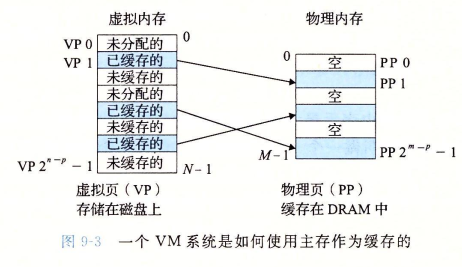
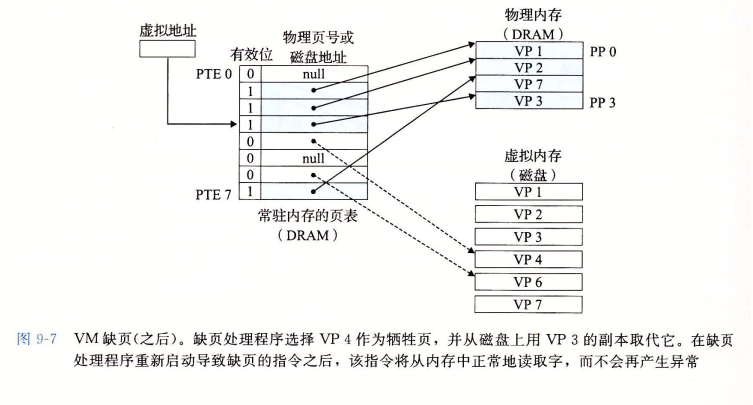
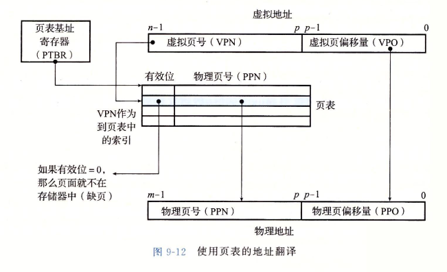
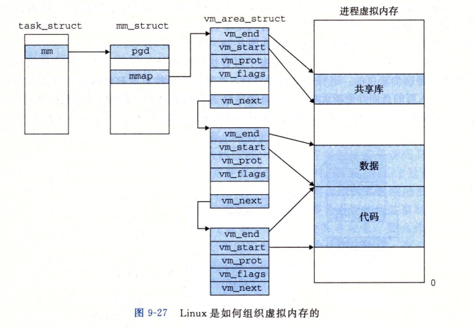
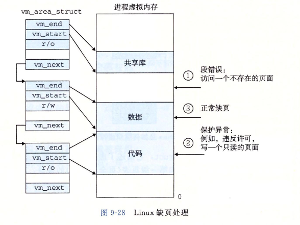
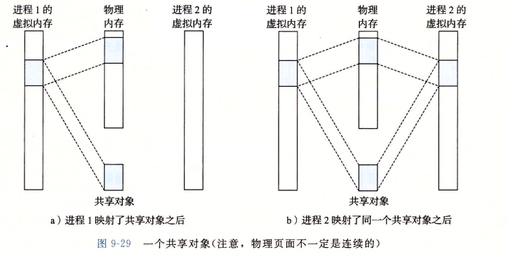

# 虚拟内存
* 一个系统中的进程是与其他进程共享ＣＰＵ和主存资源的．然而，共享主存会形成一个特殊的挑战，随着对ＣＰＵ需求的增长，进程以某种合理的平滑方式满了下来．但是如果太多的进程需要太多的内存，那么他们中的一些根本就无法运行．当一个程序没有空间可用是，那就是它运行不好了．内存还很容易被破坏．如果某个进程不小心谢了另一个进程使用的内存，它就可能以某种完全和程序逻辑无关的令人迷惑的方式失败
* 为了更加有效地管理内存并且少出错，现代系统提供了一种对主存的抽象概念，叫做虚拟内存．虚拟内存是硬件异常＼硬件地址翻译＼主存＼磁盘文件和内核软件的完美交互，它为每个进程提供了一个大的＼一致的和私有的地址空间．通过一个很清晰的机制，虚拟内存提供了三个重要的能力：１）它将主存看成是一个存储在磁盘上的地址空间的高速缓存，在主存中只保存活动区域，并根据需要在磁盘和主存之间来回传送数据，通过这种方式，它高效地使用了主存．２）它为每个进程提供了已知的地址空间，从而简化了内存管理，３）它保护了每个进程的地址空间不被其他简称破坏
* 虚拟内存是计算机系统最重要的概念之一．它成功的一个主要原因就是它是沉默地＼自动地工作的，不需要应用程序员的任何干涉．既然虚拟内存在幕后工作的如此之好，为什么程序员需要理解它呢？
  * 虚拟内存是核心的，虚拟内存编辑计算机系统的所有层面，在硬件异常＼汇编器＼链接器＼加载器＼共享对象＼文件和进程的设计中扮演这重要角色．理解虚拟内存将帮助你更好地理解系统通常是如何工作的
  * 虚拟内存是强大的．虚拟内存给予应用程序强大的能力，可以创建和销毁内存片＼将内存片映射到磁盘文件的某个部分，以及与其他进程共享内存．比如，可以通过读写内存位置或者修改一个磁盘文件的内容，或者加载一个文件的内容到内存中，而不需要进行任何显式地复制
  * 虚拟内存是危险的．每次应用程序引用一个变量＼间接引用一个指针，或者调用一个注入ｍａｌｌｏｃ这样的动态分配程序是，它就会和虚拟内存发生交互，如果虚拟内存使用不当，应用将遇到复杂危险的与内存有关的错误．例如，一个带有错误指针的程序可以立即崩溃与＂段错误＂或者＂保护错误＂，它可能在崩溃之前还默默地运行了几个小时，或者是令人惊慌地，运行完成却出现不正确的结果．理解虚拟内存以及诸如ｍａｌｌｏｃ之类的管理虚拟内存的分配程序，可以帮助你避免这些错误
* 从两个角度来看虚拟内存．一是描述虚拟内存如何工作，后一部分描述应用程序如何使用和管理虚拟内存．无可避免的事实是虚拟内存很复杂，好消息是如果掌握这些细节你就能手工模拟一个小系统的虚拟内存机制，而且虚拟内存的概念将永远不在神秘
* 第二部分是建立在这种理解之上的，向你展示了如何在程序中使用和管理虚拟内存．你讲学会如果通过显式的内存映射和对像ｍａｌｌｏｃ程序装的动态内存分配器的调用来管理虚拟内存．你还将了解到Ｃ程序中的大多数常见的与内存有关的错误，并学会如何避免他们的出现

# 物理和虚拟寻址
* 计算机系统的主存被组织成一个由M个连续的字节大小的单元组成的数组．每字节都有一个唯一的物理地址．第一个字节的地址为０．接下来的字节地址为１，再下一个为２，一次类推，给定这种简单地结构，ＣＰＵ访问内存的最自然的方式就是使用物理地址．我们把这种方式成为物理寻址．图中展示了一个物理寻址的实例，该实例的上下文是一条加载指令，它读取从物理地址４处开始的４字节字．当ＣＰＵ执行这条加载指令时，会生成一个有效物理地址，通过内存总线，把它传递给主存．主存取出物理地址４处开始的４字节字，并将它返回给ＣＰＵ，ＣＰＵ会将它放在一个寄存器例
* 早期的PＣ使用物理寻址，而且诸如数字信号处理器＼嵌入式为控制机器以及ＣＲＡＹ超级计算机这样的系统仍然继续使用这种寻址方式．然而，现代处理器使用的是一种成为虚拟寻址的寻址形式
* 使用虚拟寻址，ＣＰＵ通过生成一个虚拟地址来访问主存，这个虚拟地址被送到内存之前线转换成适当的物理地址．当一个虚拟地址胡在哪换位物理地址的任务叫做地址翻译．就像异常处理一样，地址翻译需要ＣＰＵ硬件和操作系统之间的紧密合作．ＣＰＵ芯片上叫做内存管理单元的专用硬件，利用存放在驻村中的查询表来动态翻译虚拟地址，该标的内容由操作系统管理

# 地址空间
* 地址空间是一个非负整数地址的有序集合，{0,1,2,...}
* 如果地址空间中的整数是连续的，那么我们说它是一个线性地址空间，为了简化讨论，我们总是假设使用的是线性地址空间．为了简化讨论，我们总是假设使用的是线性地址空间．在一个带虚拟内存的系统中，ＣＰＵ从一个有N=2^n个地址的地址空间中生成虚拟地址，这个地址空间成为虚拟地址空间
* 一个地址空间的大小是由表示最大地址所需要的位数来描述的．例如，一个包含Ｎ=2^n个地址的虚拟地址空间就叫做一个ｎ位地址空间．现代系统通常支持３２为或者６４为虚拟地址空间
* 一个系统还有一个物理地址空间，对应于系统中物理内存的Ｍ个字节，Ｍ不要求是２的幂，大师为了简化讨论，假设M=2＾ｍ
* 地址空间的概念是很重要的，因为它清楚地区分了数据对象(字节)和他们的属性(地址)．一旦认识到了这种区别，那么我们就可以将其推广，允许每个数据对象有多个独立的地址，其中每个地址都选自一个不同的地址空间，这就是虚拟内存的基本思想．主存中的每字节都有一个玄子虚拟地址空间的虚拟地址和一个选自物理地址空间的物理地址

# 虚拟内存作为缓存工具
* 概念上而言，虚拟内存被组织为一个由存放在磁盘上的Ｎ和连续的字节大小的单元组成的数组．每字节都有一个唯一的虚拟地址，作为数组的索引．磁盘上数组的内容被缓存在主存中，和存储器层次结构中其他缓存一样，磁盘上的数据被分割成块，这些块作为磁盘和贮存之间的传输单元．ＶＭ系统通过将虚拟内存分割为成为虚拟页的大小固定的块来处理这个问题，每个虚拟页的大小为Ｐ=2*p字节．类似地，物理内存被分割为物理页，大小也为Ｐ字节(物理页也被称为页帧)
* 在任意时刻，虚拟页面的集合部分为三个不相交的子集：
  * 未分配的：ＶＭ系统还未分配的页．未分配的块没有任何数据和它们相关联，因此也就不占用任何磁盘空间
  * 缓存的：当前已缓存在物理内存中的已分配页
  * 未缓存的：未缓存在物理内存中的已分配页
* 途中的实例展示了一个有８个虚拟页的小虚拟内存．虚拟页０和３还没有被分配，因此在磁盘上还不存在．虚拟页１＼４和６被缓存在物理内存中．页２＼５和７已经被分配了，但是当前并未缓存在主存中．

#### ＤＲＡＭ缓存的组织结构
* 为了有助于清晰理解存储层次结构中不同的缓存概念，我们将使用属于ＳＲＡＭ缓存来表示位于ＣＰＵ和主存之间的Ｌ１＼Ｌ２和Ｌ３高速缓存，它在主存中缓存虚拟页．
* 在存储层次结构中，ＤＲＡＭ缓存的位置对它的组织结构有很大的影响．回想一下，ＤＲＡＭ比ＳＲＡＭ要慢大约１０倍，而磁盘比ＤＲＡＭ，慢大约１０００００多倍，一次你ＤＲＡＭ缓存中的不命中比起ＳＲＡＭ缓存中的不命中要昂贵地多，这是因为ＤＲＡＭ缓存不命中要由磁盘来服务，而ＳＲＡＭ缓存不命中通常是由基于ＤＲＡＭ的主存来服务的．而且，从磁盘的一个扇区读取第一个字节的时间开销比起读这个扇区中连续的字节要慢大约１０００００倍，归根到底，ＤＲＡＭ缓存的组织结构完全是由巨大的不命中开销驱动的
* 因为大的不命中处罚和访问第一个字节的开销，虚拟页往往很大，通常是４ｋｂ~２ＭＢ，由于打的不命中处罚，ＤＲＡＭ缓存是全相连的，及任何虚拟页都可以放置在任何的物理页中．不命中时的替换政策也很重要，因为替换错了虚拟页的处罚也非常职高．因此，与硬件对ＳＲＡＭ缓存相比，操作系统对ＤＲＡＭ缓存使用了更复杂精密的替换算法．这些替换算法超出了我们的讨论范围．最后，因为对磁盘的访问时间很长，ＤＲＡＭ缓存总是使用写回，而不是直写

#### 页表
* 同任何缓存一样，虚拟内存系统必须有某种方法来判定一个虚拟页是否缓存在ＤＲＡＭ中某个地方．如果是，系统还必须确定这个虚拟页存放在那个物理页中．如果不命中，系统必须判断这个虚拟页存放在磁盘的那个位置，在物理内存中选择一个牺牲页，并将虚拟页从磁盘复制到ＤＲＡＭ中替换这个牺牲页
* 这些功能是由软硬件联合提供的，包括操作系统软件＼ＭＭＵ(内存管理单元)中的地址翻译硬件和一个存放在物理内存中叫做页表的数据结构，页表将虚拟页映射到物理页．每次地址翻译硬件讲一个虚拟地址转换为物理地址是，都会读取页表．操作系统负责维护页表的内容，以及在磁盘与ＤＲＡＭ之间来回传送页
* 图中展示了一个页表的基本组织结构．页表就是一个页表条目的数组，虚拟地址空间中的每个页在页表中一个固定偏移量处都有一个ＰＴＥ．为了我们的目的，我们将假设每个ＰＴＥ是由一个有效位和一个ｎ位地址子弹组成的．有效位表明了该虚拟页当前是否被缓存在ＤＲＡＭ中．如果设置了有效位，呢么地质资源就表示了ＤＲＡＭ中相应的物理页的起始位置，这个物理页中相应的物理页的起始位置，这个物理页中缓存了该虚拟页．如果没有设置有效位，呢么一个空地址表示这个虚拟页还未被分配．否则，这个地址就指向该虚拟页在磁盘上的起始位置．
* 图中的示例展示了一个有８个虚拟页和４个物理页的系统的页表．四个虚拟页当前被缓存在ＤＲＡＭ中．两个页还未被分配，而剩下的页已经被分配了，但是当前还未被缓存．图中有一个要点要注意，因为ＤＲＡＭ缓存是全相连的，所以任意物理页都可以包含任意虚拟页．

#### 页命中
* 考虑一下当ＣＰＵ想要读包含在ＶＰ２中的虚拟内存的一个字时会发生什么．ＶＰ２被缓存在ＤＲＡＭ中，使用某一种基数，地址翻译硬件将在虚拟地址作为一个索引来定位ＰＴＥ２，并从内存中读取它，因为设置了有效位，那么地址翻译硬件就知道ＶＰ＠
* 是缓存在内存中的了，所以它使用ＰＴＥ中的物理内存地址，构造出了这个字的物理地址．

#### 缺页
* 在虚拟内存的习惯说法中，ＤＲＡＭ缓存不命中成为缺页．图６中展示了在缺页之前我们的示例页表的状态，ＣＰＵ引用了ＶＰ３中的一个字，ＶＰ３并未缓存在ＤＲＡＭ中．地址翻译硬件从俄你村中读取ＰＴＥ３，从有效位推断出ＶＰ３被缓存，并且触发一个缺页异常．缺页异常调用内核中的缺页异常处理程序，该程序会选择一个牺牲页，在此例中就是存放在ｐｐ　３中的ＶＰ４．如果ＶＰ４已经被修改了，那么内核就将它复制会磁盘，无论那种情况，内核都会修改ＶＰ４的页表条目，反映出ＶＰ４不在缓存在主存中这一事实

* 接下来内核从磁盘复制ＶＰ３到内存中的ＰＰ３，更新ＰＴＥ３，随后返回．当异常处理程序返回时，它会重新启动导致缺页的指令，该指令会把导致缺页的虚拟地址重１发送到地址翻译硬件．但是现在，ＶＰ３已经缓存主存中了，那么页命中也能由地址翻译硬件正常处理了，图７展示了在缺页之后我们的示例页表的状态

* 虚拟内存实在２０实际６０年代早起发明的，远在ＣＰＵ－内存之间差距的加大引发产生ＳＲＡＭ之前．因此，虚拟内存系统使用了和ＳＲＡＭ缓存不同１的属于，即使他们的许多概念是相似的．在虚拟内存的习惯说法中，块被称为页．在磁盘和内存之间传送页的活动叫做交换或者页面调度．页从磁盘接入ＤＲＡＭ和从ＤＲＡＭ换出磁盘．一直等待，直到最后时刻，也就是当有不命中发生时，才换入页面的这种策略称为按需页面调度．也可以采用其他的方法，例如尝试这预测不命中，在页面实际被引用之前就还如页面．然而，所有现代系统都是用的是按需页面调度．

#### 又是局部性救了我们
* 当我们中的许多人都了解了虚拟内存的概念之后，我们的第一印象通常是它的效率应该是非常低．因为不命中处罚很大，我们担心页面调度会皮怀程序性能．实际上，虚拟内存工作得相当好，这主要归功于我们的老朋友１局部性
* 尽管在整个运行过程中程序引用的不同页面的总数可能超出物理内存总的大小，但是局部性原则保证了在任意时刻，程序将却相遇在一个较小的活动页面集合上工作，这个集合叫做工作集或者常驻集合．在初始开销，也就是将工作集页面调度到内存中之后，接下来对这个工作集的引用将导致命中，而不会产生额外的磁盘流量
* 只要我们的程序有好的时间局部性，虚拟内存系统就能工作得相当好．但是，当然不是所有的程序都能展现练好的时间局部性．如果工作集的大小超出了物理内存的大小，那么程序将产生一种不幸的状态，叫做抖动，这是页面将不断地换进换出．虽然虚拟内存通常是有效的，但是如果一个程序性能慢的像爬一样，那么聪明的程序员会考虑是不是发生了抖动

# 虚拟内存作为内存管理的工具
* 虚拟地址是一个有用的机制，因为它大大地简化了内存管理，并提供了一种自然地保护内存的方法．
* 到目前为止，我们都假设有一个单独的页表，讲一个虚拟地址空阿金映射到物理地址空间．实际上，操作系统为每个进程提供了一个独立的页表，因而页就是一个独立的虚拟地址空间．图９展示了基本思想．在这个实例中，进程ｉ的页表将ＶＰ１映射到ＰＰ２，ＶＰ２映射到ＰＰ７．相似地，进程ｊ的页表将ＶＰ映射到ＰＰ７，ＶＰ２映射到ＰＰ０．注意，多个虚拟页面可以映射到同一个共享物理页面上
* 按需页面调度和独立的虚拟地址空间的结合，对系统中内存的使用和管理造成了深远的影响．特别地，ＶＭ简化了链接和加载＼代码和数据共享，以及应用程序的内存分配，
  * 简化链接．独立的地址空间允许每个进程的内存映像使用相同的基本格式，而不管代码和数据实际存放在物理内存的何处．
  * 简化加载．虚拟内存还使得容易向内存中加载客户自行文件和共享对象文件，要把木白哦文件中.text节和.date节加载到一个新创建的进程中．ｌｉｎｕｘ加载器为代码和数据段分配虚拟页，把他们标记为无效的，将页表条目指向目标文件中适当的位置．有趣的是，加载器从不从磁盘到内存实际赋值任何数据．在每个页初次被引用是，要么是ＣＰＵ取指令是引用的，要么是一条正在执行的指令引用一个内存位置时引用的，虚拟内存系统会按照需要自动地调入数据页
* 将一组连续的虚拟页映射到任意一个文件中的任意位置的表示法称作内存映射．ｌｉｎｕｘ提供一个成为ｍｍａｐ的系统调用，允许应用程序自己做内存映射
  * 简化共享．地理地址空间为操作系统提供了一个管理用户进程和操作系统自身之间共享的已知机制．一般而言，每个进程都有自己私有的代码＼数据＼堆以及栈区域，是不和其他进程共享的，在这种情况中，操作系统创建页表，将相应的虚拟页映射到不连续的物理页面
* 然而，在一些情况中，还是需要进程来共享代码和数据．例如，每个进程必须同时调用相同的操作系统内核代码，而每个Ｃ程序都会调用Ｃ标准库中的程序．操作系统通过将不同进程中适当的虚拟页面银四个号到相同的物理页面，从而安排多个进程共享这部分代码的一个副本，而不是每个进程都包括单独的内核和Ｃ标准库的副本，如图９所示
  * 简化内存分配．虚拟内存为向用户进程提供一个简单地分配额外内存的机制，当一个运行在用户进程中的程序要求额外的对空暗金石，操作系统分配一个适当数字个连续的虚拟内存页面，并且将他们因社会到物理内存中任意位置的ｋ个任意的物理页面．由于页表工作的方式，操作系统没有必要分配ｋ个连续的物理内存页面．页面可以随机地分散在物理内存中．

# 虚拟内存作为内存保护的工具
* 任何现代计算机系统必须为操作系统提供手段来控制对内存系统的访问．不应该允许一个用户进程修改它的只读代码段．而且也不应该允许任何内核中的代码和数据结构．不应该允许它读或者写其他进程的私有内存，并且不允许它修改任何与其他进程共享的虚拟页面，除非所有的共享着都显式地允许它这么做．
* 就像我们所看到的，提供独立的地址空阿金使得区分不同进程的私有内存变量变得容易．但是，地址翻译机制可以以一种自然的方式扩展到提供更好的访问控制．因为每次ＣＰＵ生成一个地址是，地址翻译硬件都会读一个ＰＴＥ，所以通过在ＰＴＥ上添加一些额外的许可位来控制对一个虚拟页面内容的访问十分简单．图１０展示了大致的思想

* 在这个实例中，每个ＰＴＥ中已经添加了三个许可位．ＳＵＰ位表示进程是否必须运行在内核１模式下才能访问该页．运行在内核模式中的进程可以访问任何页面，但是运行在用户模式中的级才能只允许访问那些ＳＵＰ为０的页面．ＲＥＡＤ位和ＷＲＩＴＥ位控制对页面的读和写访问．例如，如果进程ｉ运行在用户模式下，那么它有读ＶＰ０和读写ＶＰ１的权限．然而，不允许它访问ＶＰ２
* 如果一条指令违反了这些许可条件，那么ＣＰＵ就触发一个一般保护故障，将控制传递给一个内核中的异常处理程序．ｌｉｎｕｘ　ｓｈｅｌｌ一般将这种异常报告为段错误

# 地址翻译
* 目标是了解硬件在支持虚拟内存中的角色，省略了大量的细节，尤其是和时序相关的细节．
* 形式上来说，地址翻译是一个Ｎ元素的虚拟地址空间中的元素和一个Ｍ元素的物理地址空间中元素之间的映射
* 图中展示了ＭＭＵ如何利用页表来实现这种映射．ＣＰＵ中的一个控制寄存器，页表基址寄存器指向当前页表．ｎ位的虚拟地址包含两个部分：一个Ｐ位的虚拟页面偏移和一个(n-p)位的虚拟页号

* ＭＭＵ利用ＶＰＮ来选择适当的ＰＴＥ．例如，ＶＰＮ　０选择ＰＴＥ　０，以此类推，将页表条目中物理页号和虚拟地址中的ＶＰＯ串联起来，就得到相应的物理地址．注意，因为物理和虚拟页面都是Ｐ字节的，所以物理页面偏移和ＶＰ０是相同的．
* 图ａ展示了当页面命中时，ＣＰＵ硬件执行的步骤：
  * 第一步：处理器生成一个虚拟地址，并把它传送给ＭＭＵ
  * 第二步：ＭＭＵ生成ＰＴＥ地址，并从高速缓存或者主存请求得到它
  * 第三步：高速缓存或者主存向ＭＭＵ返回ＰＴＥ
  * 第四步：ＭＭＵ构造物理地址，并把它传送给高速缓存或者主存
  * 第五步：高速缓存或者主存返回锁清秋的数据字给处理器

* 页面命中是由硬件来处理的，与之不同的是，处理缺页要求硬件和操作系统内核协作完成，如图ｂ所示
  * 第一步到第三步：和图中相同
  * 第四步：ＰＴＥ中的有效位是零，所以ＭＭＵ触发了一次一场，传递ＣＰＵ中的控制到操作系统内核中的缺页异常处理程序
  * 第五步：缺页处理程序确定出物理内存中的牺牲页，如果这个页面已经被修改了，则把它换出到磁盘
  * 第六步：缺页处理程序页面调入新的页面，并更新内存中的ＰＴＥ
  * 第七步：缺页处理程序返回到原来的进程，再次执行导致缺页的指令．ＣＰＵ将引起缺页的虚拟地址重新发送给ＭＭＵ．因为虚拟页面现在缓存物理内存中，所以就会命中，在ＭＭＵ执行了图ｂ中１的步骤之后，

#### 结合高速缓存和虚拟内存
* 在任何既使用ＳＲＡＭ高速缓存的系统中，都有应该使用虚拟地址还是使用物理地址来访问ＳＲＡＭ高速缓存的问题．尽管关于这个折中的详细讨论已经超出了我们的讨论范围，但是大多数系统是选择物理殉职的．使用物理寻址，多个进程同时在告诉缓存中有存储块和共享来自相同虚拟页面的块１成为很简单的事情．而且，高速缓存无需处理保护问题，因为访问权限的检查是地址翻译过程的一部分
* 图１４展示了一个物理寻址的告诉缓存如何和虚拟内存结合起来．主要思路是地址翻译发生在高速缓存查找之前．注意，页表条目可以缓存，就像其他的数据字一样
! [VM与缓存的结合.png](VM与缓存的结合.png)

#### 利用ＴＬＢ加速地址翻译
* 正如我们看到的，每次ＣＰＵ产生一个虚拟地址，ＭＭＵ就必须查阅一个ＰＴＥ，以便将虚拟地址翻译为物理地址．在最糟糕的情况下，这个要求从内存多取一次数据，代价是几十到几百个周期．如果ＰＴＥ碰巧缓存在Ｌ１中，那么开销就下降到１个或２个周期．然而，许多系统都试图消除即使是这样的开销，他们的ＭＭＵ中包括了一个关于ＰＴＥ的小的缓存，成为翻译后备缓冲器．
* ＴＬＢ是一个小的＼虚拟寻址的缓存，其中每一行都保存着一个有单个ＰＴＥ组成的块，ＴＬＢ通常有高度的相连度．如图所示，用于组选择和行匹配的索引和标记字段是从虚拟地址中的虚拟页号中提取出来的．如果ＴＬＢ有Ｔ-2^t个组，么儿ＴＬＢ索引是由ＶＰＮ的ｔ个最低位组成的，而ＴＬＢ标记是有ＶＰＮ中剩余的位组成的．图ａ展示了当ＴＬＢ命中时所包括的步骤．这里的关键点是，所有的地址翻译步骤都是在新蒲安上的ＭＭＵ中执行的，因此非常快
  * 第一步：ＣＰＵ产生一个虚拟地址．
  * 第二步和第三步:ＭＭＵ从ＴＬＢ中取出相应的ＰＴＥ
  * ＭＭＵ和这个虚拟地址翻译成一个物理地址，并且将它发送到高速缓存或者主存
  * 告诉缓存或者主存将所请求的数据字返回还给ＣＰＵ
* 当ＴＬＢ不命中是，ＭＭＵ必须从Ｌ１缓存中相应的ＰＴＥ，如图ｂ所示．新取出的ＰＴＥ存放在ＴＬＢ中，可能会覆盖一个已经存在的条目

#### 多级页表
* 到目前为止，我们已知假设系统只用一个单独的页表进行地址翻译．但是如果我们有一个３２位的地址空间＼４ｋｂ的页面和一个４字节的ＰＴＥ．那么即使应用所引用的只是虚拟地址空阿金中很小的一部分，也总是需要一个４ＭＢ的页表驻留在内存中．对于地址空间为６４为的系统来说，问题将变得更复杂．
* 用来压缩页表的常用方法是使用层次机构的页表．用一个具体的市里是最容易理解这个思想的．假设３２为虚拟地址有如下形式：内存的前２Ｋ个页面分配给了代码和数据，家下来的６ｋ个页面还未分配，在家下来的１０２３个页面也未分配，接下来的１个页面分配给了用户栈．图中展示了我们如何为这个虚拟地址空阿金构造一个两级的页表层次结构
* 一级页表中的每个ＰＴＥ负责映射虚拟地址空间中一个４ＭＢ的片，这里每一片都是有１０２４个连续的页面组成的．
* 二级页表中的每个ＰＴＥ都负责映射一个４ＫＢ的虚拟内存页面，就像我们查看只有以及的页表一样．注意，使用４字节的ＰＴＥ，每个以及和二级页表都是４ＫＢ字节，这刚和一个页面的大小是一样的
* 这种方法从两个方面减少了内存要求．第一，如果以及页表中的一个ＰＴＥ是空的，那么相应的二级页表就根本不会存在．这代表着一种巨大的潜在节约，因为对于一个典型的程序，４ＧＢ的虚拟地址空间的大部分都是未被分配的，第二，只有以及页表才需要总是在主存中；虚拟内存系统可以在需要时创建＼页面调入或调出二级页表，这就减少了主存的压力；只有最经常使用的二级页表才需要缓存在主存中．

#### ｌｉｎｕｘ虚拟内存系统
* 一个虚拟内存系统要求硬件和内核软件之间的紧密协作．版本与版本之间细节都不尽相同，对此完整的阐述超出了我们讨论的范围．但是，在这一小节中我们的目标是ｌｉｎｕｘ的虚拟内幕才能系统做一个描述，使你能够大致了解一个实际的操作系统是如何组织虚拟内存，以及如何处理缺页的
* ｌｉｎｕｘ为每个进程维护了一个单独的虚拟地址空间，形式如图所示，包括它那些熟悉的代码＼数据＼堆＼共享库以及栈段．既然我们理解了地址翻译，就能够填入更多的关于内核虚拟内存的细节了，这部分虚拟内存位于用户栈之上．
* 内核虚拟内存包含内核中的代码和数据结构．内核虚拟内存的某些区域被映射到所有进程共享的物理页面．例如，每个进程共享刚内核的代码和全局数据结构．有趣的是，ｌｉｎｕｘ也将一组连续的虚拟页面(大小等于系统中ＤＲＡＭ的总量)映射到相应的一组连续的物理页面，这就为内核提供了一种遍历的方法来访问物理内存中任何特定的位置，例如，当它需要访问页表，或在一些设备上执行内存映射的ＩＯ操作，而这些设备被映射到特定的物理内存位置时．
* 内核虚拟内存的其他区域包含每个进程都不相同的数据．比如说，页表＼内核在进程的上下文中执行代码时使用的栈，以及记录虚拟地址空间当前组织的各种数据结构

#### ｌｉｎｕｘ虚拟内存区域
* ｌｉｎｘｕ将虚拟内存组织成一些区域的集合．一个区域就是已经存在着的(已分配)虚拟内存的链接片，这些页是以某种方式相关联的，例如，代码段＼数据段＼堆＼共享库段，以及用户栈都是不同的区域．每个存在的虚拟页面都保存在某个区域中，而不属于某个区域的虚拟页是不存在的，并且不能被进程引用．区域的概念很重要，因为它允许虚拟地址空间有间隙．内核不用记录那血不存在的虚拟页，而这样的页也不占用内存＼磁盘或者内存本身中的任何额外资源．
* 图２７强调了记录一个进程中虚拟内存区域的内核数据结构．内核为系统中的每个进程维护一个单独的任务结构．任务结构中的元素包含或者指向内核运行该进程所需要的所有信息(例如，PID＼指向用户栈的指针＼可执行目标文件的名字，以及程序计数器)．

* 任务结构中的一个条目指向mm_struct，它描述了虚拟内存的当前状态．我们感兴趣的两个字段是ｇｐｄ和ｍｍａｐ，区中ｐｇｄ指向第一级页表的机制，而mmap指向一个vm_area_structs(区域结构)的链表，区中每个vm_area_structs都描述了当前虚拟地址空间的一个区域．党内和运行这个进程时，就将ｐｇｄ存放在ＣＲ３控制寄存器中．
* 为了我们的目的，一个具体区域的区域结构包含下面的字段：
  * vm_start:指向这个区域的起始处
  * vm_end:指向这个区域的结束处
  * vm_prot:描述这个区域内包含的所有页的读写许可权限
  * vm_flags:描述这个区域内的页面是与其他进程共享的，还是这个进程私有的
  * vm_next:指向链表中下一个区域结构

#### ｌｉｎｕｘ缺页异常处理
* 假设ＭＭＵ在试图翻译某个虚拟地址Ａ时，出发了一个缺页．这个异常导致控制转移到内核的缺页处理程序，处理程序随后就执行下面的步骤：
  * 虚拟地址Ａ是合法的吗？换句话说，Ａ在某个区域结构定义的区域内码？为了回答这个问题，缺页处理程序搜索区域结构的链表，把Ａ和每个区域结构中的vm_start和vm_end做比较．如果这个指令是不合法的，那么缺页处理程序就处罚一个段错误，从而终止这个进程．这个情况在图２８中表示为＂１＂．因为一个进程可以创建任意数量的新虚拟内存区域,所以顺序搜索区域结构的链表花销可能会很大．因此在实际中，linux使用某些我们没有显示出来的字段，ｌｉｎｕｘ在链表中构建了一棵树，并在这个书上进行查找．
  * 试图进行的内存访问是否合法？换句话说没进城是否有读＼写或者执行这个区域内页面的权限？例如，这个缺页是不是由一条试图对这个代码段里的只读页面进行写操作的存储指令造成的？这个缺页是不是因为一个运行在用户模式中的进程试图从内核虚拟内存中读取字造成的？如果试图进行的访问是不合法的，那么缺页处理程序会处罚一个保护异常，从而终止这个进程．这种情况在图２８中表示为＂２＂．
  * 此刻，内核知道了这个缺页是由于对合法的虚拟地址进行合法的操作造成的．它是这样来处理这个１缺页的：选择一个牺牲页面，如果这个牺牲页面被修改过，那么就将它交换出去，换入新的页面并更新页表．当缺页处理程序返回时，ＣＰＵ重新启动引起缺页的指令，这条指令将在此发送Ａ到ＭＭＵ．这次，ＭＭＵ就能正常翻译Ａ，而不会在产生缺页中断了．

# 内存映射
* linux通过将一个虚拟内存区域与一个磁盘上的对象关联起来，以初始化这个虚拟内存区域的内容，这个过程称为内存映射．虚拟内存区域可以映射到两种类型的对象中的一种
* １）linux文件系统中的普通文件：一个区域可以映射到一个普通磁盘文件的连续部分，例如一个可执行目标文件．文件区被分成页大小的片，每一片包含一个虚拟页面的初始化内容．因为按需进行页面调度，所以这些虚拟页面没有实际交换进入物理内存，直到ＣＰＵ第一次引用到页面(即发射一个虚拟地址，落在地址空间这个页面的范围之内)，如果区域比文件区要大，那么就用零来填充这个区域的余下部分．
* ２）匿名文件：一个区域也可以映射到一个匿名文件，匿名文件是由内核创建的，包含的全是二进制零．ＣＰＵ第一次引用这样一个区域内的虚拟页面时，内核就在物理内存中找到一个牺牲页面，如果该页面是被修改过的，就将这个页面换出来，用二进制１零覆盖牺牲页面并更新页表，将这个页面标记位是驻留在内存中的．注意是在磁盘和内存之间并没有实际的数据传送．因为这个原因，映射到匿名文件的区域中的页面有时也叫做请求二进制零的页
* 无论哪种情况中，一旦一个虚拟页面被初始化了，它就在一个由内核维护的专门的交换文件之间换来换去．交换文件也叫做交换空间或者交换区域．需要意识到很重要的一点是，在任何时刻，交换空间都限制着当前运行着的程序能够分配的虚拟页面的总数

#### 再看共享对象
* 内存映射的概念来源于一个聪明的发现：如果虚拟内存系统可以集成到传统的文件系统中，呢么就能提供一种简单而高效的把程序和数据加载到内存中的方法
* 正如我们已经看到的，进程这一抽象能够为每个进程提供自己私有的虚拟空间，可以免受其他进程的错误读写．不过，许多进程有同样的只读代码区域．例如，每个运行linux shell程序bash的进程都有相同的代码区域．而且，许多程序需要访问只运行时库代码的相同副本．例如，每个Ｃ程序都需要来自标准Ｃ库的注入printf这样的函数，那么，如果每个进程都在物理内存中保持这些常用代码的副本，那就是极端的浪费了．幸运的是，内存映射给我们提供了一种清晰的机制，用来控制多个进程如何共享对象．
* 一个对象可以被映射到虚拟内存的一个区域，要么作为共享对象，要么作为私有对象．如果一个进程将一个共享对象映射到它的虚拟地址空间的一个区域内，那么这个进程对这个区域的任何写操作，对于那些也罢这个共享对象银四个号到他们虚拟内存的其他进程而言，也是可见的．而且，这些变化也会反映在磁盘上的原始对象中．另一方面，对于一个映射到私有对象的区域做的改变，对于其他进程来说是不可见的，并且进程对这个区域所做的任何写操作都不会反映在磁盘上的对象中．一个映射到共享对象的虚拟内存区域叫做共享区域．类似地，也有私有区域
* 假设进程１将一个共享对象映射到它的虚拟内存的一个区域中，如图ａ所示．现在假设进程２将同一个共享对象映射到它的地址空间(并不一定要和进程１在相同的虚拟地址出，如图ｂ所示)

* 因为每个对象都有一个唯一的文件名，内核可以迅速地判定进程１已经１映射到了这个对象，而且可以使进程２中的页表条目指向对应的物理页面．关键点在于即使对象被映射到了多个共享区域，物理内存中也只需要存放共享对象的一个副本，为了方便，我们将物理页面显示为连续的，但是在一般情况下当然不是这样的．
* 私有对象使用一种叫做写时赋值的巧妙技术被映射到虚拟内存中．一个私有对象开始生命周期的方式基本上与共享对象的一样，在物理内存中只保存有私有对象的一份副本．比如，图３０ａ展示了一种情况，其中两个进程讲一个私有对象映射到他们虚拟内存的不同区域，但是共享这个对象同一个物理副本．对于每个映射私有对象的进程，相应私有区域的页表条目都被标记为只读，并且区域结构１被标记位私有的写时赋值．只要没有进程试图写它自己的私有区域，它们就可以继续共享物理内存中对象的一个单独副本．然而，只要有一个进程试图１写自己的私有区域，它们就可以继续共享物理内存中对象的一个单独副本．然而，只要有一个进程试图写私有区域内的某个页面，那么这个写操作就会触发一个保护故障．
* 当故障处理程序注意到保护异常是由与进程试图写私有的写时赋值区域中的一个页面而引起的，他就会在物理内存中创建这个页面的一个新副本，更新页表条目指向这个新的副本，然后这个页面的可写权限，如图３０ｂ所示．当故障处理程序返回时，ＣＰＵ重新执行这个写操作，现在在新创建的页面上这个写操作就可以正常执行了．

* 通过延迟私有对象中的副本知道最后可能的时刻，写时复制最充分地使用了稀有的物理内存．

#### 再看ｆｏｒｋ函数
* 既然我们理解了虚拟内存和内存映射，那么我们可以清晰地知道ｆｏｒｋ函数是如何组件一个带有自己独立虚拟地址空间的新进程的．
* 当ｆｏｒｋ函数被当前进程调用时，内核为新进程创建各种数据结构，并分配给它１一个唯一的ＰＩＤ，为了给这个新进程创建虚拟内存，它创建了当前进程的mm_struct＼区域结构和页表的原样副本．他将两个进程中的每个页面都标记为只读，并将两个进程１中的每个区域结构都标记位为私有的写时复制．
* 当ｆｏｒｋ在新进程中返回时，新进程现在的虚拟内存刚好和调用ｆｏｒｋ时存在的虚拟内存相同，当这两个进程中的任一个后来进行写操作时，写时赋值机制就会创建新页面，因此，也就为每个进程保持了私有地址空间的抽象概念

#### 再看ｅｘｅｃｖｅ函数
* 虚拟内存和内存映射在将程序加载到内存的过程中也扮演者关键的角色．既然已经理解了这些概念，我们能够理解ｅｘｅｃｖｅ函数实际上是如何加载和执行程序的．假设执行在当前进程中的程序执行了如下ｅｘｅｃｖｅ调用：

        execve("a.out",NULL.NULL)
* 正如之前学到的，ｅｘｅｃｖｅ函数在当前进程中加载并运行包含在可执行目标文件a.out中的程序，用a.out程序有效地代替了当前程序．加载并运行a.out需要以下几个步骤：
  * 删除已存在的用户区域．删除当前进程虚拟地址的用户部分中的已存在的区域结构
  * 映射私有区域．为新程序的代码＼数据＼ｂｓｓ和栈区域创建新的区域结构．所有这些新的区域都是私有的＼写时赋值的．代码和数据区域被映射为a.out文件中的.text和.data区．bss区域是请求二进制零的，映射到匿名文件，其大小包含在a.out中．栈和堆区域也是请求二进制零的，初始长度为零．图３１概括了私有区域的不同映射．
  * 映射共享区域．如果a.out程序与共享对象链接，比如标准Ｃ库libc.so，那么这些对象都是动态链接到这个程序的，然后在映射到用户虚拟地址空间中的共享区域内．
  * 设置程序计数器．ｅｘｅｃｖｅ做的最后一件事情就是设置当前进程上下文中的程序计数器，使之指向代码区域的入口点
* 下一次调度这个进程时，它将从这个入口点开始执行．linux将根据需要还如代码和数据页面．

####　使用mmap函数的用户级内存映射
* linux进程可以使用mmap函数来创建新的虚拟内存区域，并将对象映射到这些区域中．
* mmap函数要求内核创建一个新的虚拟内存区域，最好是从地址start开始的一个区域，并将文件描述符ｆｄ指定的对象的一个连续的片映射到这个新的区域．连续的对象片大小为length字节，从距文件开始处偏移量为offset字节的地方开始．start地址仅仅是一个暗示，通常被定义为NULL．为了我们的目的，我们总是假设其实起始地址为NULL．图３２描述了这些参数的定义．

* 参数prot包含描述新银四个号的虚拟内存区域１的访问权限位(即在相应区域结构中的vm_prot位)
  * PROT_EXEC:这个区域内的页面由可以被ＣＰＵ执行的指令组成
  * PROT_READ:这个区域的页面可读
  * PROT_WRITE:这个区域的页面可写
  * PROT_NONE:这个区域内的页面不能被访问
* 参数flags有描述被映射对象类型的位组成．如果设置了MAP_ANON标记位，那么映射的对象就是一个匿名对象，而相应的虚拟页面是请求二进制零的．MAP_PRIVATE表示被映射的对象是一个私有的＼写时赋值的对象，而MAP_SHARED表示是一个共享对象

# 动态内存分配
* 虽然可以使用低级的mmap和munmap函数来创建和删除虚拟内存的区域，但是Ｃ程序员还是会觉得当运行时需要额外虚拟内存是，用动态内存分配器更方便，也有更好的可移植性．
* 动态内存分配器维护着一个进程的虚拟内存区域，称为堆．系统之间细节不同，但是不失通用性，假设堆是一个请求二进制零的区域，它紧接着在未初始化的数据区域后开始，并向上生长．对于每个进程，内核维护者一个变量brk，它指向堆的顶部
* 分配器将堆视为一组不同大小的块的集合来维护．每个块就是一个连续的虚拟内存片，要么是已分配的，要么是空闲的．已分配的块显式地保留为供应用程序使用．空闲块可用来分配．空闲块保持空闲，直到它显式地被应用所分配．一个已分配的块保持已分配状态，直到它被释放，这种释放要么是应用程序显式执行的，要么是内存分配器自身隐式执行的．
* 分配器有两种基本风格．两种风格都要求应用显式地分配块．他们的不同支出在于由那种实体来负责释放已分配的块．
  * 显示分配器，要求应用显式地释放任何已分配的块．例如，Ｃ标准库提供一种叫做ｍａｌｌｏｃ程序包的显式分配去．Ｃ程序通过调用ｍａｌｌｏｃ函数来分配一个块，并通过调用ｆｒｅｅ函数来释放一个块．Ｃ++中的ｎｅｗ和ｄｅｌｅｔｅ操作符与Ｃ中的ｍａｌｌｏｃ和ｆｒｅｅ相当
  * 隐式分配器，另一方面，要求分配器检测一个已分配块何时不在被程序所使用，那么就释放这个块．隐式分配器也叫做垃圾收集器，而自动释放未使用的已分配的块的过程叫做垃圾收集．例如，诸如Lisp\ML以及ｊａｖａ之类的高级语言就依赖垃圾收集释放已分配的块

#### 垃圾收集
* 在诸如Ｃ malloc包这样的显示分配器中，应用通过调用ｍａｌｌｏｃ和ｆｒｅｅ来分配和释放堆块．应用要负责释放所有不再需要的已分配块
* 未能释放已分配的块是一种常见的编程错误．下面的Ｃ函数，作为处理的一部分，它分配为一块临时存储

        void garbage()
        {
            int *p=(int *)malloc(15213);
            return;
        }
* 因为程序不再需要Ｐ，所以在garbage返回前应该释放ｐ．不行的是，程序员忘了释放这个块．它在程序的生命周期内都保持为已分配状态，毫无必要地占用着本来可以用来满足后面分配请求的堆空间．
* 垃圾收集器是一种动态内存分配器，它自动释放程序不再需要的已分配块．这些块被称为垃圾．自动回收堆程序的过程叫做垃圾收集．在一个支持垃圾收集的系统中，应用显式分配堆块，但是从不显示地释放它们．在Ｃ程序的上下文中，应用调用ｍａｌｌｏｃ，但是从不调用ｆｒｅｅ．反之，垃圾收集器定期识别垃圾块，并相应地调用ｆｒｅｅ，将这些块放回到空闲链表中．

#### 垃圾收集器的基本知识
* 垃圾收集器将内存视为一张有向可达图，其形式如图４９所示，该图的节点被分成一组跟节点和一组堆节点．每个堆节点对应于堆中的一个已分配块．有向边p->q意味着某个位置指向块ｑ中的某个位置．根节点对应于这样一种不在堆中的位置，他们中包含指向堆中的指针，这些位置可以是寄存器＼栈里的变量，或者是虚拟内存中读写数据区域内的全局变量

* 当存在一条从任意根节点出发并到达ｐ的有向路径是，我们说节点ｐ是可达的．在任何时刻，不可达节点对应于垃圾，是不能被应用再次使用的．垃圾收集器的角色是维护可达图的某种表示，并通过释放不可达节点且将他们返回给空闲链表，来定期地回收它们．
* 像ＭＬ和Ｊａｖａ这样的语言的垃圾收集器，对应于如何创建和使用指针有很严格的控制，能够维护可达图的一种精确的表示，因此也就能够回收所有垃圾．然而，诸如Ｃ和ｃ++这样的语言收集器通常１不能维持可达图的精确表示．这样的收集器也叫作保守的垃圾收集器．从某种意义上来说他们是保守的，即每个可达快都被正确１地标记为可达了，而一些不可达节点却可能被错误地标示为可达．
* 收集器可以按需提供他们的服务，或者他们可以作为一个和应用并行的独立线程，不断地更新可达图和回收垃圾．例如，考虑如何将一个Ｃ程序１的收集器加入到已存在的ｍａｌｌｏｃ包中，如图所示

* 无论何时需要堆空间时，应用都会用通常的方式调用malloc．如果malloc找不到一个合适的空闲块，那么它就调用垃圾收集器，希望能够回收一些垃圾到空闲链表．收集器识别出垃圾块，并通过调用ｆｒｅｅ函数将他们返回给堆．关键的思想是收集器代替应用去调用ｆｒｅｅ．当对收集器的调用返回时，ｍａｌｌｏｃ充实，试图发现一个适当的空闲块．如果还是失败了，那么它就会向操作系统要求额外的内存．最后，ｍａｌｌｏｃ返回一个指向请求块的指针或者返回一个空指针

#### Markdown&Sweep垃圾收集器
* Markdown&Sweep垃圾收集器由标记阶段和清楚阶段组成，标记阶段标记出根阶段的所有可达的和已分配的后继，而后面的清楚阶段释放每个未被标记的已分配块．块头部中空闲的低位中的一位通常用来表示这个块是否被标记了
* 我们对Markdown&Sweep的描述将假设使用下列函数，其中ptr定义为typedef void *ptr:
  * ptr isPtr(ptr p).如果ｐ指向一个已分配块中的某个字，那么就返回一个指向这个块的起始位置的指针ｂ．否则返回ＮＵＬＬ
  * int blockMarked(ptr b):如果块ｂ是已标记的，那么就返回ｔｒｕｅ
  * int blockAllocated(ptr b):如果块ｂ是已分配的，那么就返回ｔｒｕｅ．
  * void markBlock(ptr b):标记块ｂ．
  * int length(b):返回块ｂ的以字为单位的长度(不包括头部)
  * void unmarkBlock(ptr b):将块ｂ的状态由已标记的未标记的
  * ptr nextBlock(ptr b):返回堆中块ｂ的后继
* 标记阶段为每个根节点调用一次ｍａｒｋ函数．如果ｐ不知想一个已分配并且标记的堆块，ｍａｒｋ函数就立即返回．否则，它就标记这个块，并对块中的每个字递归地调用它自己．每次对ｍａｒｋ函数的调用都标记某个根节点的所有未标记并且可达的后集节点．在标记阶段的末尾，任何未标记的已分配块都被认为是不可达的，是垃圾，可以在清除阶段回收
* 清除阶段是对图ｂ所示的ｓｗｅｅｐ函数的一次调用．ｓｗｅｅｐ函数在堆中每个块上反复循环，释放它所遇到的所有未标记的已分配块(也就是垃圾)
* 图５２展示了一个小堆的Mark&Sweep的图形化解释．块便捷用粗线条表示．每个方块对应于内存中的一个字．每个块都有一个字的头部，要么是已标记的，要么是未标记的．

* 初始情况下，图５２中的堆由６个已分配块组成，其中每个块都是未分配的．第三块包含一个指向第一块的指针．第四块包含指向第三块和第六块的指针．跟指向第四块，在标记阶段之后，第一块＼第三块＼第四块和第六块被做了标记，因为他们是从根节点可达的，第２块和第５块是未标记的，因为他们是不可达的．在清除阶段之后，这两个不可达块被回收到空闲链表

#### Ｃ程序的保守Mark&Sweep
* Mark&Sweep对Ｃ程序的垃圾收集是一种何时的方法，因为它可以就地工作而不需要移动任何块．然而，Ｃ语言为isPtr函数的实现造成了一些有趣的挑战
* 第一，Ｃ不会用任何类型信息来标记内存位置，因此，对isPtr没有一种明显的方式来判断它的输入参数ｐ是不是一个指针，第二，即使我们知道ｐ是一个指针，对isPtr也没有明显的方式来判断ｐ是否指向一个已分配块的有效载荷中的某个位置．
* 然后一系列问题的解决方法是将已分配块集合维护成一颗平衡二叉树，这棵树保持这这样一个属性：左子树中所有的块都放在较小的地址处，而右子树中的所有块都放在较大的地址出．如图５３所示，这就要求每个以分配块的头部例有两个附加字段．每个字段都指向某个已分配块的又不．isPtr函数用来执行对已分配块的二分查找．在每一步中，它以来于块头部中的大小字段来判断ｐ是否落在这个块的范围之内．

* 平衡树方法保证会标记所有从根节点可达的节点，从这个意义上来说它是正确的，这是一个必要的保证，因为应用程序的用户当然不会喜欢把他们的已分配块过早地返回个空闲链表．然而，这种方法从某种意义上而言有事保守的，因为它可能不正确地标记实际上不可达的块，因此它可能不会释放某些垃圾．虽然这并不影响应用程序的正确性，但是这可能导致不必要的外部碎片
* Ｃ程序的Mark&Sweep收集器必须是保守的，其根本原因是Ｃ语言不会用类型信息来标记内存位置．因此，向ｉｎｔ或者ｆｌｏａｔ这样的标量可以伪装成指针，例如，假设某个科大的已分配块在它的有效载荷中包含一个ｉｎｔ，其值碰巧对应于某个其他已分配块ｂ的有效载荷中的一个地址．对收集器而言，是没有办法推断出这个数据实际上是ｉｎｔ而不是指针．因此，分配器必须保守地将块ｂ标记为可达，尽管事实上它可能是不可达的

# ｃ程序中常见的与内存有关的错误
* 对Ｃ程序员来说，管理和使用虚拟内存可能是个困难的＼容易出错的任务．与内存有关的错误属于那些最令人惊恐的错误，因为他们在时间和空间上，经常在距错误源一段距离之后才表现出来．将错误的数据写到错误的位置，你的程序可能在最终失败之前运行了好几个小时，且使程序中止的位置已经很远了．

#### 间接引用坏指针
* 在进程的虚拟地址空间中有较大的洞，没有映射到任何有意义的数据，如果我们试图间接引用一个指向这些洞的指针，那么操作系统就会以短一长中止程序．而且，虚拟内存的某些区域是只读的．试图写这些区域将会以保护异常中止这个程序
* 间接引用坏指针的一个常见市里是经典的ｓｃａｎｆ错误．假设我们想要使用ｓｃａｎｆ从标准输入读一个整数到一个变量．正确的方法是传递给ｓｃａｎｆ一个格式串和变量的地址，然而，对于ｃ程序员初学者而言，很容易传递变量的内容，而不是它的地址
* 间接情况下，ｓｃａｎｆ将把变量的内容解释为一个地址，并试图将一个字写到这个位置．在最好的情况下，程序立即以异常中止．在最糟糕的情况下，ｖａｌ的内容对应于虚拟内存的某个合法的读或者写区域，于是我们就覆盖这块内存，这通常会在相当长的一段时间以后造成灾难性＼令人困惑的后果

#### 读初始化的内存
* 虽然bss内存位置总是被加载器初始化为０，但是对于堆内存却并不是这样的．一个常见的错误就是假设堆内存被初始化为零

#### 允许栈缓冲区溢出
* 如果一个程序不检查输入串的大小就写入栈中的目标缓冲区，呢么这个程序就会１有缓冲区溢出错误．例如，下面的函数就有缓冲区溢出错误，因为ｇｅｔｓ函数赋值一个人异常的的串到缓冲区．为了纠正这个错误，我们必须使用fgets函数，这个函数限制了输入串的大小

#### 假设指针和他们指向的对象是相同大小的
* 一种常见的错误是假设指向对象的指针和他们所指向的对象是相同大小的

### 造成错位错误
* 错位错误是另一种很常见的造成覆盖错误的来源：

                int **makeArray2(int n,int m)
                {
                        int i;
                        int **A=(int **)malloc(n*sizeof(int *));
                        for(i=0;i<=n;i++)
                        {
                                A[j]=(int *)malloc(m*sizeof(int));
                                return A;
                        }
                }
* 第五行创建了一个ｎ个元素的指针数组，但是随后在第７行和第８行试图初始化这个数组的n+1个元素，在这个过程中覆盖了Ａ数组后面的某个内存位置

#### 引用指针，而不是它所指向的对象
* 如果不太注意Ｃ操作符的优先级１和结合型，我们就会错误地操作指针，而不是指针所指向的对象．比如，考虑下面的函数，其目的是删除一个有*　size项的二叉堆例的第一项，然后对剩下的*size-1项重新建堆．

#### 误解指针运算
* 临一中常见的错误是忘记了指针的算术操作是以他们指向的对象的大小为单位来进行的，而这种大小单位并不一定是字节．

#### 引用不存在的变量
* 没有太多经验的Ｃ策划那个许愿不理解栈的规则，有事会引用不在合法的本地变量，如下列表示：

                int *stackref()
                {
                        int val;
                        return &val;
                }
* 这个函数返回一个指针，指向栈例的一个局部变量，然后弹出它的栈帧．尽管ｐ仍然指向一个合法的内存你地址，但是它已经不在指向一个合法的变量了．当以后在程序中调用其他函数时，内存将重用它们的栈帧．再后来，如果程序分配某个值给*p，那么它可能实际上正在修改另一个函数的栈帧中的一个条目，从而潜在地带来灾难性的＼令人困惑的后果．

#### 引用空闲堆块中的数据
* 一个相似的错误是引用了已经被释放了的堆块中的数据．

#### 引起内存泄露
* 内存泄露是缓慢的＼隐性的杀手，当程序员不小心忘记释放已分配块，而在队里创建了垃圾是时，会发生这种问题．例如下面的函数分配了一个堆块ｘ，然后不释放它就返回：

                void leak(int n)
                {
                        int *x=(int *)malloc(n*sizeof(int));
                        return;
                }
* 如果经常调用ｌｅａｋ，那么渐渐地，堆里就充满了垃圾，最糟糕的情况下，会占用整个虚拟地址空间．对于向守护进程和服务器这样的程序来说，内存泄露是特别严重的，根据定义这些程序是不会终止的．

# 小结
* 虚拟内存是对主存的一个抽象．支持虚拟内存的处理器通过使用一种叫做虚拟寻址的间接形式来引用主存．处理器产生一个虚拟地址，在被发送到主存之前，这个地址被翻译成一个物理地址．从虚拟地址空间到物理地址空间的地址翻译要求硬件软件紧密合作．专门的硬件通过使用页表来翻译虚拟地址，而页表的内容是由操作系统提供的
* 虚拟内存提供三个重要的功能．第一，它在主存中自动缓存最近使用的存放磁盘上的虚拟地址空间的内容．虚拟内存缓存中的块叫做页．对磁盘上页的引用会触发缺页，缺页将控制转移到操作系统中的一个缺页处理程序．缺页处理程序将页面从磁盘复制到主存缓存，如果必要，将写回被驱逐的页．第二，虚拟内存通过在每条页表条目中加入保护胃，从而简化了内存保护．
* 地址翻译过程必须和系统中所有硬件缓存的操作集成在一起．大多数页表条目位于Ｌ１高速缓存中，打宝石一个成为ＴＬＢ的页表条目的片上高速缓存，通常会消除访问在Ｌ１上的页表条目的开销．
* 现代系统将通过虚拟内存片和磁盘上的文件片相关联起来，来初始化虚拟内存片，这个过程成为内存映射．内存一个社为共享数据＼创建新的进程以及加载程序提供了一种高效的机制．应用可以使用mmap函数来手工地创阿金和删除虚拟地址空间的区域，然而，大多数程序依赖于动态内存分配器，例如ｍａｌｌｏｃ，它管理虚拟地址空间区域内一个成为堆的区域．动态内存分配器是一个感觉向系统即程序的应用机车供需，它直接操作内存，而无需类型系统的很多帮助．分配器有两种类型．显式分配器要求应用程序显式地释放它们的内存块．隐式分配器(垃圾收集器)自动释放任何未使用的和不可达的块．
* 对于Ｃ程序员来说，管理和使用虚拟内存是一件困难和容易出错的任务．常见的错误市里包括：间接使用坏指针，读取未初始化的内存，允许栈缓冲区溢出，假设指针和他们指向的对象大小相同，引用指针而不是它所指向对象，误解指针运算，引用不存在的变量，以及引起内存泄露．
