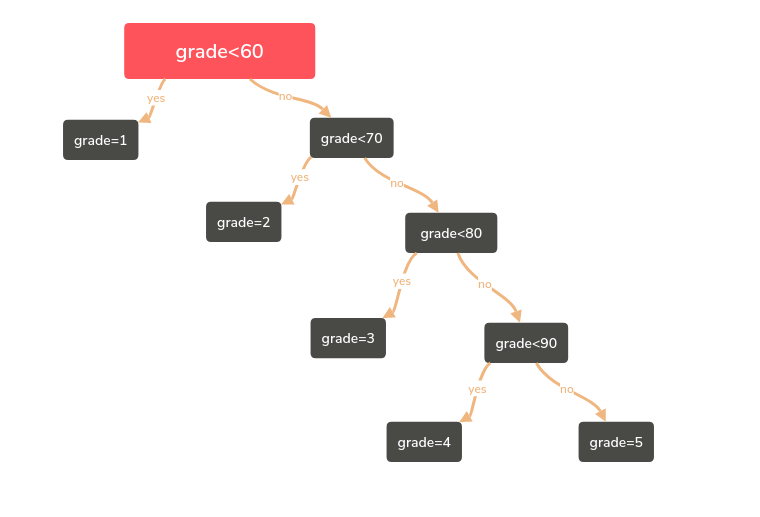
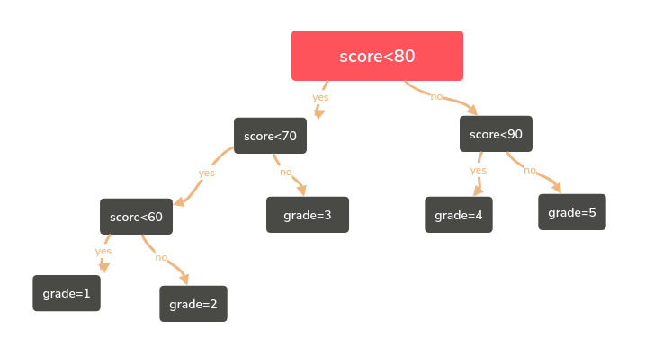
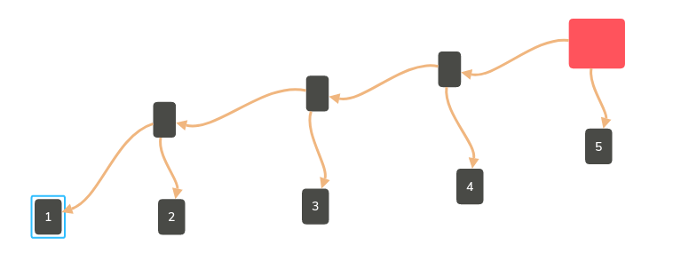
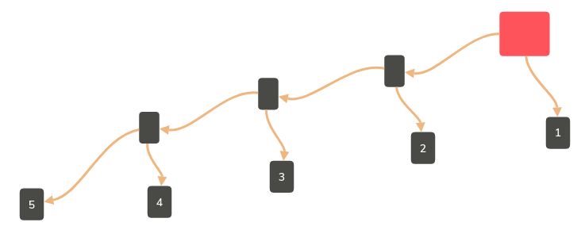
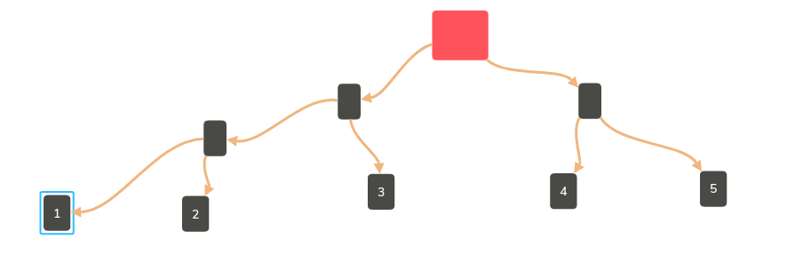
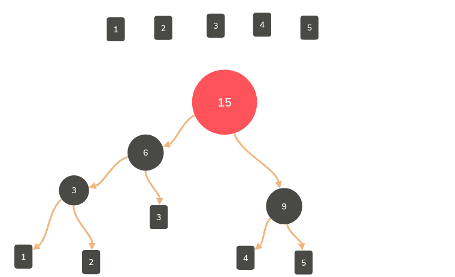
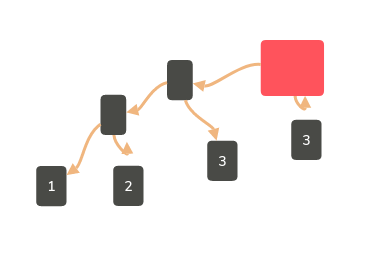
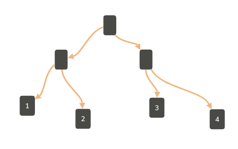
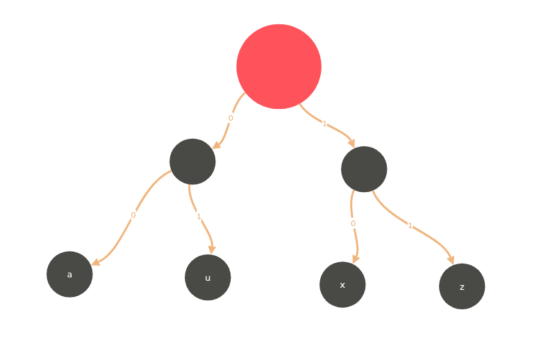
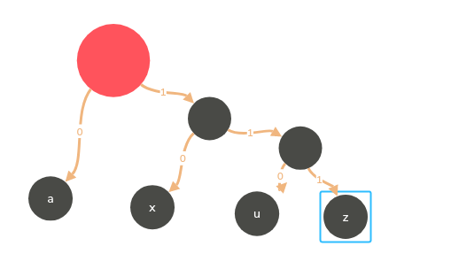

## 哈弗曼树与哈弗曼编码

### 什么是哈弗曼树
* 例：将百分制的考试成绩转换成五分制的成绩

        if(score<60)
        {
            grade=1;
        }
        else if(score<70)
        {
            grade=2;
        }
        else if(score<80)
        {
            grade=3;
        }
        else if(score<90)
        {
            grade=4;
        }
        else
        {
            grade=5;
        }
  * 判定树
    * 查找效率为3.15（次数乘以频率）

* 例：将百分制的考试成绩转换称五分制的成绩

        if(score<80)
        {
            if(score<70)
            {
                if(grade<60)
                {
                    grade=1;
                }
                else
                {
                    grade=2;
                }
            }
            else if(score<90)
            {
                grade=4;
            }
        }
        else
        {
            grade=5;
        }
  * 判定树
    * 查找效率为2.2

* 如何根据节点不同的查找频率构造更有效的搜索树——这是哈弗曼树要解决的问题

#### 哈弗曼树的定义
* 带权路径长度（WPL）：设二叉树有n个叶子节点，每个叶子节点带有权值Wk，从根结点到每个叶子结点的长度为Lk，则每个叶子结点的带权路径长度之和就是：W1×L1+...+Wn×Ln
* 最优二叉树或哈弗曼树：WPL最小的二叉树
* 例：有五个叶子结点他们的权值为{1,2,3,4，5}，用此权值序列可以构造出形状不同的多个二叉树。
  * WPL=5×1+4×2+3×3+2×4+1×4=34

* WPL=50

* WPL=33

#### 哈弗曼树的构造
* 每次把权值最小的两棵二叉树合并

        typedef struct TreeNode* HuffmanTree;
        struct TreeNode
        {
            int weight;
            HuffmanTree Left,Right;
        };
        HuffmanTree Huffman(MinHeap H)
        {
            //假设H->Size个权值已经存在H->Elements[]->weight里
            int i;
            HuffmanTree T;
            BuildMinHead(H);//将H->Element[]按权值调整为最小堆
            for(i=1;i<H->size;i++)//做H->Size-1次合并
            {
                T=malloc(sizeof(struct TreeNode));//建立新结点
                T->Left=DeleteMin(H);//从最小堆中删除一个结点，作为新T的左子结点
                T->Right=DeleteMin(H);//从最小堆中删除一个结点，作为新T的右子结点
                T->weight=T->Left->weight+T->Right->weight;//计算新权值
                Insert(H,T);//将新T插入最小堆
            }
            return T;
        }
        //整体复杂度为O(N logN)

#### 哈弗曼树的特点
* 没有度为1的节点
* n个也字节带你的哈弗曼树共有2n-1个结点
* 哈弗曼树的任意非叶结点的左右子树交换后仍是哈弗曼树；
* 对同一组权值{W1...Wn}，是否存在不同构的两棵哈弗曼树呢？
  * 对同一组权值{1,2,3,4}，不同构的两棵哈弗曼树：

* WPL=18

### 哈弗曼编码
* 给定一段字符串，如何对字符进行编码，可以使该字符串的编码存储空间最少？
  * 【例】假设有一段文本，包含58个字符，并由以下7个字符构成：a，e，i，s，t，空格（sp），换行（nl）；这七个字符出现的次数不同，如何对这7个字符进行编码，使得总编码空间最少？
    * 【分析】
      1. 用等长ASCII编码：58×8=464位；
      2. 用等长三位编码：58×3=174位；
      3. 不等长编码：出现频率高的字符用的编码短些，出现频率低的字符则可以编码长些？
* 如何进行不等长编码？
  * 如何避免二义性？
    * 前缀码prefix code：任何字符的编码都不是另一字符编码的前缀
      * 可以无二义的解码
* 二叉树用于编码
  * 用二叉树进行编码：
    * 左右分支：1\0
    * 字符只在叶节点上 

* 四个字符的频率：a4,u1,x2,z1;

* Cost(aaaxuaxz->0000001001001011)=2×4+2×1+2×2+2×1=16

* Cost(aaaxuaxz->00010110010111)=1×4+3×1+2×2+3×1=14
