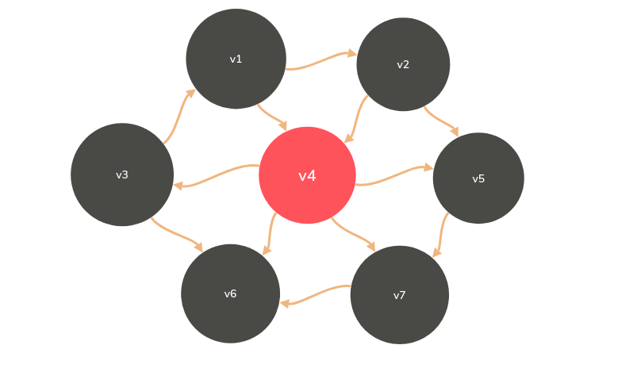

### clock函数的使用

* clock():捕捉从程序开始运行到clock()被调用时所耗费的时间。这个时间单位是clock tick，即“始终打点”（不同机器打点时间不同）

* 常数CLK_TCK:机器时钟美妙所走的时钟打点数。

        #inlude<stdio.h>
        #include<time.h>

        clock_t start,stop;
        //clock_t是clock()函数返回的变量类型
        double duration;
        int main(void)
        {//不在测试范围的准备工作写在clock（）函数调用之前
            start=clock();//开始计时
            Myfunction();
            stop=clock;
            duration=((double)(stop-start))/CLK_TCK;
        //其他不在测试范围的处理写在后面，例如输出duration的值
        }

* 如果运行时间过快，可以将程序多运行几次，再将时间除以运行次数

### 什么是图
* 表示多对多的关系
* 包含
  * 一组定点：通常用V（vertex）表示顶点集合
  * 一组边：通常用E（Edge）表示边的集合
    * 边是顶点对：（v，m）属于E，其中v，w属于V
    * 有向边<v,w>表示从v指向w的边（单行线）
    * 不考虑重边和自回路
  
## 抽象数据类型
* 类型名称：图（Graph）
* 数据对象集:G(V,E)由一个飞空的优先顶点集合V和一个有限边集合E组成。
* 操作集：对于任意图G属于Graph,以及v属于V,e属于E
  
        Graph Creat();//建立并返回空图
        Graph InsertVertex(Graph G,Vertex e);//将v插入G
        Graph InsertEdge(Graph G,Edge e);//将e插入G
        void DFS(Graph G,vertex v);//从顶点v出发深度优先遍历图G
        void BFS(Graph G,vertex v);//从顶点v出发宽度优先遍历图G
        void shortestPath(Graph G,vertex,int Dist[]);//计算图G中顶点v到任意其他顶点的最短距离
        void MST(Graph G);//计算图的最小生成树

## 怎么在程序中表示表示一个图
* 邻接矩阵（二维数组）G[N][N]——N个顶点从0到N-1编号,节点间有边就为1，无边为0
* 用一个长度为N(N+1)/2的一维数组A存储矩阵的下三角（按行来存）：比邻接矩阵节省一般空间
* 邻接矩阵有什么好处：
  * 直观、简单、好理解
  * 方便检查任意一对顶点间是否存在边
  * 方便找任意顶点的所有“邻接点”（右边直接相连的顶点）
  * 方便计算任一顶点的“度”（从该点出发的边数为“出度”，指向该点的边数为入度）
    * 无向图：对应行（或列）非0元素的个数
    * 有向图：对应行非零元素的个数为“出度”；对应列非零元素的个数为”入度“

* 邻接矩阵有什么不好
  * 浪费空间——存稀疏图（点很多而边很少）有大量无效元素
    * 对稠密图（特别是完全图）还是很合算的
  * 浪费时间——统计稀疏图中一共有多少边

* 邻接表（一定够稀疏才合算）：G[N]为指针数组，对应矩阵每行一个链表，只存非0元素。对于网络，结构中要增加权重的域
  * 方便找任一顶点的所有“邻接点”
  * 节约稀疏图的空间
    * 需要N个头指针+2E个节点（每个节点至少2个域）
  * 方便计算任一顶点的度？ 
    * 对无向图：是的
    * 对有向图：只能计算“出度”；需要构造“逆邻接表”（存指向自己的边）来方便计算“入度”。
  * 方便检查任意一对顶点是否存在边？（很麻烦）

## 图的遍历
* 深度优先搜索

        //类似于树的先序遍历
        void DFS(Vertex V)
        {
            Visited[V]=true;
            for(v的每个邻接点W)
            {
                if(!Visited[W])
                {
                    DFS(W);
                }
            }
        }
* 若有N个顶点、E条边，时间复杂度是
  * 用邻接表存储图，有O(N+E)
  * 用邻接矩阵存储图，有O(N^2)

* 广度优先搜索（Breadth First Search,BFS）

        void BFS(Vertex V)
        {
            visited[V]=true;
            Enqueue(V,Q);
            while(!TsEmpty(Q))
            {
                V=Dequeue(Q);
                for(V的每个邻接点W)
                {
                    if(!visited[W])
                    {
                        visited[W]=true;
                        Enqueue(W,Q);
                    }
                }
            }
        }

* 若有N个顶点、E条边，时间复杂度是
  * 用邻接表存储图，有O(N+E)
  * 用邻接矩阵存储图，有O(N^2)

## 最短路径问题
* 在网络中，求两个不同顶点之间的所有路径中，边的权值之和最小的那一条路径
  * 这条路径就是两点之间的最短路径(Shortest Path)
  * 第一个顶点为源点(Source)
  * 最后一个顶点为终点(Destination)
* 单元最短路径问题：从某固定源点出发，求其到素有其他顶点的最短路径
  * （有向）无权图
  * （有向）有权图
* 多源最短路径问题：求任意两顶点间的最短路径

### 无权图的单源最短路算法
* 按照递增（非递减）的顺序找出到各个顶点的最短路
  * 0：->v3
  * 1:->v1 and v6
  * 2:->v2 and v4
  * 3:->v3 and v7
  

* BFS!算法