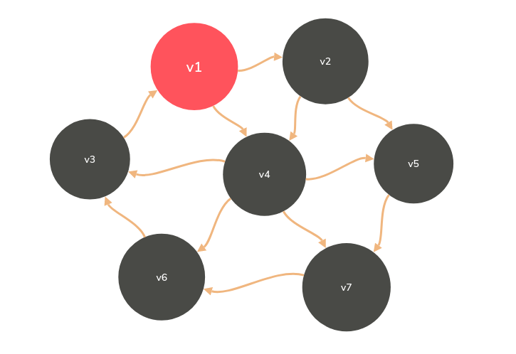

## 多源最短路算法
#### Floyd算法
* Dk[i][j]=路径{i->{l<=k}->j}的最小长度
* D0,D1,...,D(|v|-1)[i][j]即给出了i到j的真正最短距离
* 最初的D-1是什么？
* 当D(k-1)已经完成，递推到Dk时：
  * 或者k不属于最短路径{i->{l<=k}->j},则Dk=D(k-1)
  * 或者k属于最短路径{i->{l<=k}->j},则该路径必定由两段最短路径组成：Dk[i][j]=D(k-1)[i][k]+D(k-1)[k][j];

        void Floyd()
        {
            for(i=0;i<N;i++)
            {
                for(j=0;j<N;j++)
                {
                    D[i][j]=G[i][j];
                    path[i][j]=-1;
                }
            }
            for(k=0;k<N;k++)
            {
                for(i=0;i<N;i++)
                {
                    for(j=0;j<N;j++)
                    {
                        if(D[i][j]+D[k][j]<D[i][j])
                        {
                            D[i][j]=D[i][k]+D[k][j];
                            path[i][j]=k;
                        }
                    }
                }
            }
        }

## 最小生成树问题(Minimum Spanning Tree)
#### 什么是最小生成树
* 是一棵树
  * 无回路
  * |v|个顶点有|v-1|条边
* 是生成树
  * 包含全部顶点
  * |v|-1条边都在图里
* 边的权重和最小
* 最小生成树存在<->图连通

#### 贪心算法
* 什么是贪：每一步都要最好的
* 什么是好：权重最小的边
* 需要约束：
  * 只能用图里有的边
  * 只能正好用掉|v|-1条边
  * 不能有回路

###### prime算法——让一颗小数长大

* 与Dijkstra算法相似

        void Dijkstra(Vertex s)
        {
            while(1)
            {
                V=未收录顶点中dist的最小者;
                if(这样的V不存在)
                {
                    break;
                }
                collect[V]=true;
                for(V的每个临界点W)
                {
                    if(collect[W]==false)
                    {
                        if(dist[V]+E<v,w><dist[W])
                        {
                            dist[W]=dist[V]+E<v,w>;
                            path[W]=v;
                        }
                    }
                }
            }
        }

* prime算法(稠密图)：从节点入手，搜索与节点相连的边，收录权重最小的边，之后从这条边到达下一个节点，递归执行此过程

        void Prime()
        {
            MST={s};
            while(1)
            {
                V=未收录顶点中dist的最小者;
                if(这样的v不存在)
                {
                    break;
                }
                将V收录进MST;
                for(v的每个临界点W)
                {
                    if(W未被收录)
                    {
                        if(E<v.w><dist[W])
                        {
                            dist[W]=E<v,W>;
                            patent[W]=V;
                        }
                    }
                }
            }
            if(MST中收录的顶点不到|V|个)
            {
                Error("生成树不存在！");
            }
        }//dist[V]应被初始化为E<v,w>或正无穷

* Kruskal算法——将森林合并成树:直接遍历整个图，从边入手，按权重有小到大的顺序将边收录，注意：不能构成回路，从最小权重的边开始收录

        void Kruskal(Graph G)
        {
            MST={ };
            while(MST中不到|v|-1条边&&E中还有边)
            {
                从E中取出权重最小的边E<v,w>；//最小堆
                将E<v,w>从E中删除；
                if(E<v,w>不在MST中构成回路)//并查集
                {
                    将E<v,w>加入MST;
                }
                else
                {
                    彻底无视E<v,w>;//即将它彻底删除
                }
            }
            if(MST中不到|V|-1条边)
            {
                Error("生成树不存在！");
            }
        }//T=O(|E|log|E|)

## 拓扑排序
* 【例】计算机专业排课

* 转化为图(AOV网络(Activity On Vertex))(每个节点表示一个事件)

* 拓扑序：如果图中从V到W有一条有向路径，则V一定排在W之前。满足此条件的顶点序列称为一个拓扑序
* 获得一个拓扑序的过程就是拓扑排序
* AOV如果有合理的拓扑序，则必定是有向五环图(Directed Acyclic Graph,DAG)

        void Topsort()
        {
            for(cnt=0;cnt<|V|;cnt++)
            {
                V=未输出的入度为0的顶点;//O(|V|)
                if(这样的v不存在)
                {
                    Error("图中有回路!");
                    break;
                }
                输出v，或者记录v的输出序号;
                for(V的每个邻接点W)
                {
                    Indegree[W]--;
                }
            }
        }//T=O(|V|^2)

* 更节约聪明的算法：随时将入度为0的顶点放到一个容器里（容器可以随意定义）

        void Topsort()
        {
            for(途中每个顶点V)
            {
                if(Indegree[V]==0)
                {
                    Enqueue(V,Q);
                }
            }
            while(!IsEmpty(Q))
            {
                V=Dequeue(Q);
                输出V,或者记录v的输出序号;
                cnt++;
                for(V的每个邻接点W)
                {
                    if(--Indegree[W]==0)
                    {
                        Enqueue(W,Q);
                    }
                }
            }
            if(cnt!=|V|)
            {
                Error("图中有回路");
            }
        }//T=O(|V|+|E|)

        //此算法还可被用来检测有向图是否为DAG

## 关键路径问题
* AOE(Activity On Edge)网络（每条边表示一个过程或一道工序）

* 只有当指向某个节点的路径所连接的节点表示的事件全部完工，这个节点才能执行并完工
* 整个工期有多长

        Earliest[0]=0;Earliest[1]=Earliest[0]+C<0,1>+6;
        Earliest[j]=max(<i,j>属于E){Earlisest[i]+C<i,j>（边ij的权重）};

* 哪组有机动时间

        //利用反推的方法，从结束那个工程开始往前推
        Latest[8]=18;latest[7]=Latest[8]-C<8,7>=14;
        Latest[i]=min(<j,i>属于E){Latest[j]-C<j,i>(边ji的权重)}
        D<i,j>=Latest[j]-Earliest[i]-C<i,j>//机动时间

### 关键路径含义：由`绝对不允许延误`的活动组成的路径

