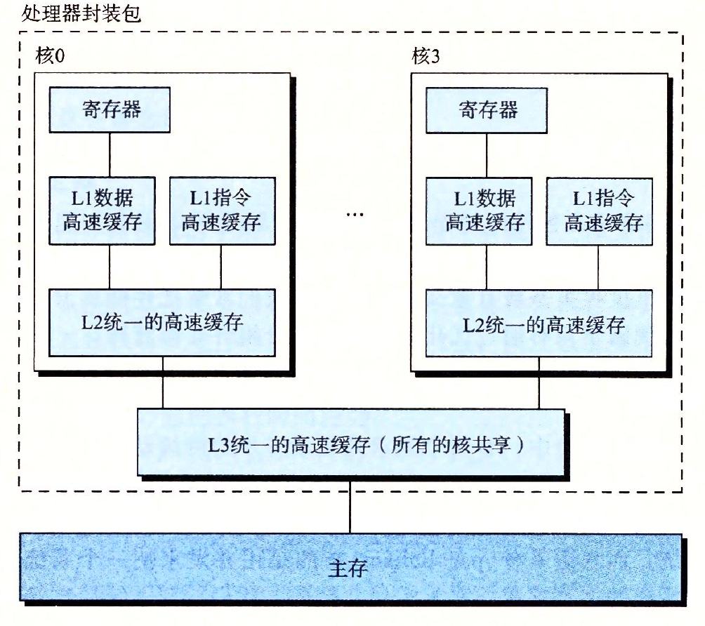

# 并发和并行的三个层次（由高到低）
## 线程级并发
* 构建在进程这个抽象上，我们能够设计出同时有多个程序执行的系统，这就导致了并发。使用线程，我们甚至能够在一个进程中执行控制流。传统意义上，这种并发执行只是模拟出来的，是通过使一台计算机在它正在执行的进程间快速切换来实现的。这种并发形式允许多个用户同时与系统交互，例如，当多个用户想要从一个Web服务器获取页面时，它还允许一个用户同时从事多个任务，例如，在一个窗口中运行Web服务器，在另一个串口中运行字处理器，同时又播放音乐。在以前，即使处理器必须在多个任务间切换，大多数实际的计算也都是有一个处理器完成，这种配置称为单处理器系统。
* 当构建一个由单操作系统内核控制的多处理器组成的系统时，我们就得到了一个多处理器系统。其实从20世纪80年代开始，在大规模的计算中就有了这种系统，但直到最近，随着多喝处理器和超线程(hyperthreading)的出现，这种系统才变得常见。
* 多核处理器时将多个CPU（称为“核”）集成到一个集成电路芯片上。下图描述的时一个典型多核处理器的组织结构，其中我给处理器芯片有4个CPU核，每个核有自己的L1和L2高速缓存，其中的L1高速缓存分为两个部分——一个保存最近取到的指令，另一个存放数据。这些和共享更高层的高速缓存，以及到主存的接口。工业界准假语言他们能够将几十个、甚至上百个核做到一个芯片上。

* `超线程`,有时称为`同时多线程(simultaneous multi-threading)`，是以像允许一个CPU执行多个控制流的技术，他设计CPU某些硬件有多个备份，比如程序计数器和寄存器文件，而其他的硬件部分只有一份，比如执行浮点运算的单元，常规的处理器需要大约2000个时钟周期做不同线程间的转换，而超线程的处理器可以在单个周期的基础上决定要执行哪一个进程。这使得CPU能够更好地利用它地处理资源。比如，假设一个线程必须等到某些数据被装载到高速缓存中，那CPU就可以继续去执行另一个线程。举例来说，因特尔酷睿i7处理器可以让每个核执行两个线程，所以一个四核地系统可以并行的执行8个线程。
* 多处理器地使用可以从两方面提高系统性能，首先，他减少了在执行多个任务时模拟并发的需要。正如前面提到的，即使是只有一个用户使用的个人计算机也需要并发的执行多个活动。其次，它可以使应用程序运行的更快，当然者必须要求程序时以多线程方式来书写的，这些线程可以并行地高效执行。一次你虽然并发原理地形成和研究已经超过50年的时间了，但是多核和超线程系统地出现才极大的激发了一种愿望，即找到书写应用程序的方法利用硬件开发线程级并行性。

## 指令级并行
* 在较低的抽象层次上，现代处理器可以同时执行多条指令的属性称为指令级并行。早期的微处理器，如1978年的因特尔8086，需要多个（通常是3到10个）时钟周期来执行一条指令。最近的处理器可以保持每个时钟周期2到4条指令的执行速率，其实每条指令从开始到结束需要产的个多的时间，大约20个或者更多周期，但是处理器使用了非常多聪明的技巧来同时处理多达100条指令。之后，我们会研究`流水线(pipelining)`的使用。在流水线中，将执行一条指令所需要的活动划分为不同的步骤，将处理器的硬件组织成一系列的阶段，每个阶段执行一个步骤，这些阶段可以并行地操作，用来处理不同指令地不同部分。我们看到一个想当简单的硬件设计，它能够接近于一个时钟周期一条指令的执行速率。
* 如果处理器可以达到一个周期一条指令的或者更快的执行速率，就称之为`超标量(super-scalar)`处理器。大多数线代处理器都支持超标量操作，

## 单指令、多数据并行
* 在最低层次上，许多现代处理器拥有特殊的硬件，允许一条指令产生多个可以并行执行的操作，这种方式称为单指令、多数据，即SMIMD并行。例如，较新几代的因特尔和AMD处理器都具有并行地对8对单精度浮点数(float)做加法的指令。
* 提供这些SIMD指令多是为了提高处理影像、声音和视频数据应用的执行速度。虽然有些编译器会试图从C程序中自动抽取SIMD并行性，但是更可靠的方法时用编译器支持的特殊的向量数据类型来写程序，比如GCC就支持向量数据类型。