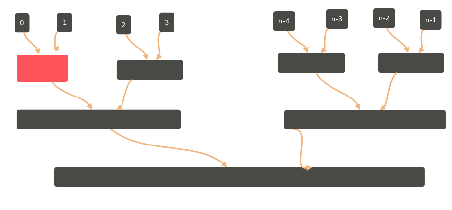

# 排序一
## 前提
* 函数头统一的规范格式void X_sort(ElementType A[],int N); 
  * 大多数情况下，为简单起见，讨论从小到大的整数排序
  * N是正整数
  * 只讨论基于比较的排序（>=<有定义）
  * 只讨论内部排序
  * 稳定性：任意两个相等的数据，排序前后的相对位置不发生改变
  * 没有一种排序是任何情况下都表现最好的
## 简单排序（冒泡，插入）
#### 冒泡排序

		void Bubble_sort(ElementType A[],int N)
		{
			for(P=N-1;P>0;P++)
			{
				flag=0;//做标记，如果未执行swap则退出循环
				for(i=0;i<P;i++)
				{
					if(A[i]>A[i+1])
					{
						Swap(A[i],A[i+1]);
						flag=1;//标记发生了变化
					}
				}
				if(flag==0)//全程无交换
				{
					break;
				}
			}
		}

* 复杂度
  * 最好情况：顺序T=O（N）；
  * 最坏情况：逆序T=O（N^2）;

#### 插入排序
  
		void Insertion_Sort(ElementType A[],int N)
		{
			for(P=1;P<N;P++)
			{
				Tmp=A[P];//摸下一张牌
				for(i=P;i>0&&A[i-1]>Tmp;i--)
				{
					A[i]=A[i-1];//移出空位
					A[i]=Tmp;//新牌落位
				}
			}
		}

* 复杂度
  * 最好情况：顺序T=O(N)
  * 最坏情况：逆序T=O(N^2)

#### 时间复杂度下界
* 对于下标i<j,如果A[i]>A[j],则称（i,j）是一对逆序对(inversion)
* 问题：序列{34,8,64,51,32,21}中有多少逆序对？9对
* 交换2个相邻元素正好消去1个逆序对！
* 插入排序：T(N,I)=O(N+I)

* 定理：任意N个不同元素组成的序列平均具有N（N-1）/4个逆序对
* 定理：任何仅以交换相邻量元素来排序的算法，其平均时间复杂度为N^2
* 这意味着：要提高算法效率，我们必须
  * 每次消去不止1个逆序对！
  * 每次交换相隔较远的2个元素！

## 希尔排序
* 定义增量序列Dm>Dm-1>...>D1=1
* 对每个Dk进行“Dk-间隔”排序（k=M，M-1，。。。1）
* 原始希尔排序Dm=|N/2|,Dk=|Dk+1/2|('||'表示如上)

		void Shell_sort(ElementType A[],int N)
		{
			for(D=N/2;D>0;D/=2)
			{
				for(P=D;P<N;P++)
				{
					Tmp=A[P];
					for(i=P;i>=D&&A[i-D]>Tmp;i-=D)
					{
						A[i]=A[i-D];
					}
					A[i]=Tmp;
				}
			}
		}

* 最坏情况：T=O（N^2）

### 更多增量序列
* Hibbard增量序列
  * Dk=2^k-1——相邻元素互质
  * 最坏情况：T=O(N^3/2)
  * 猜想：Tavg=O(N^5/4)(至今无人能够证明)
* Sedgewick增量序列
  * {1,5,19,4111091...}——9*4^i-9*2^i+1或4^i-3*2^i+1
  * 猜想：Tavg=O(N^7/6),Tworst=O(N^4/3)
## 堆排序
#### 选择排序

		void Selection_Sort(ElementType A[],int N)
		{
			for(i=0;i<N;i++)
			{
				MinPosition=ScanForMin(A,i,N-1);//从A[i]到A[N-1]中找到最小元，并将其位置赋给MinPosition
				Swap(A[i],A[Minposition]);//将未排序部分最小元换到有序部分的最后位置
			}
		}

* 无论如何:T=O(N^2)

* 如何快速找到最小元
#### 堆排序
* 算法一

		void Heap_Sort(ElementType A[],int N)
		{
			BuildHeap(A);//O(N)
			for(i=0;i<N;i++)
			{
				TmpA[i]=DeleteMin(A);//O(logN)
			}
			for(i=0;i<N;i++)//O(N)
			{
				A[i]=TmpA[i];
			}
		}
* T(N)=O(N logN)

* 算法二

		void Heap_sort(ElementType A[],int N)
		{
			for(i=N/2;i>=0;i--)
			{
				PercDown(A,i,N);
			}
			for(i=N-1;i>0;i--)
			{
				Swap(&A[0],&A[i]);//DeleteMax
				PercDown(A,0,i);
			}
		}

* 定理：堆排序处理N个不同元素的随机排列的平均比较次数是2N logN-O(Nlog LogN)
* 虽然堆排序给出最佳平均时间复杂度，但实际效果不如用Sedgewick增量序列的希尔排序

## 归并排序
* 核心：有序子列的归并
* 如果两个子列一共有N个元素，则归并的时间复杂度是多少？N

		//L=左边起始位置，R=右边起始位置，RightEnd=右边终点位置
		void Merge(ElementType A[],ElementType TmpA[],int L,int R,int RightEnd)
		{
			LeftEnd=R-1;//左边终点位置，假设左右两列挨着
			Tmp=L;//存放结果的数组的初始位置
			NumElements=RightEnd-L+1;
			while(L<=LeftEnd&&R<=RightEnd)
			{
				if(A[L]<=A[R])
				{
					TmpA[Tmp++]=A[L++];
				}
				else
				{
					TmpA[Tmp++]=A[R++];
				}
			}
			while(L<=LeftEnd)//直接复制左边剩下的
			{
				TmpA[Tmp++]=A[L++];
			}
			while(R<RightEnd)//直接复制右边剩下的
			{
				TmpA[Tmp++]=A[R++];
			}
			for(i=0;i<NumElements;i++,RightEnd--)
			{
				A[RightEnd]=Tmp[RightEnd];
			}
		}

### 递归算法
* 分而治之

		void Msort(ElementType A[],ElementType TmpA[],int L,int RightEnd)
		{
			int Center;
			if(L<RightEnd)
			{
				Center=(L+RightEnd)/2;
				Msort(A,TmpA,L,Center);
				Msort(A,TmpA,Center+1,RightEnd);
				Merge(A,TMPA,L,Center+1,RightEnd);
			}
		}
* T(N)=T(N/2)+T(N/2)+O(N)->T(N)=O(NlogN)
* 此函数借口与上边说的不一致，对用户很不友好
* 统一函数接口的函数

		void Merge_sort(ElementType A[],int N)
		{
			ElementType *TmpA;
			TmpA=malloc(N*sizeof(ElementType));
			if(TmpA!=NULL)
			{
				Msort(A,TmpA,0,N-1);
				free(TmpA);
			}
			else
			{
				error("空间不足");
			}
		}

* 如果只在Merge中声明临时数组
  * void Merge(ElementType A[],int L,int R,int RightEnd)
  * void Msort(ElementType A[],int L,int RightEnd)
* 内存会被重复地申请并释放

### 非递归算法

* 额外的空间复杂度为O(N)

		void Merge_sort(ElementType A[],int N)
		{
			int length=1;//初始化子序列长度
			ElementType *TmpA;
			TmpA=malloc(N*sizeof(ElementType));
			if(TmpA!=NULL)
			{
				while(length<N)
				{
					Merge_pass(A,TmpA,N,length);
					length*=2;
					Merge_pass(TmpA,A,N,length);
					length*=2;
				}
				free(TmpA);
			}
			else
			{
				error("空间不足");
			}
		}
* 最大缺点：需要额外的空间
* 在外排序时非常有用
