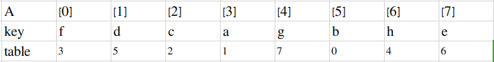
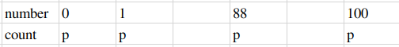
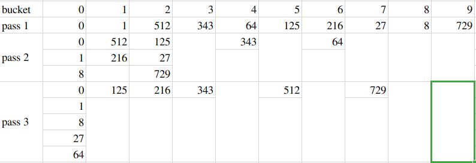
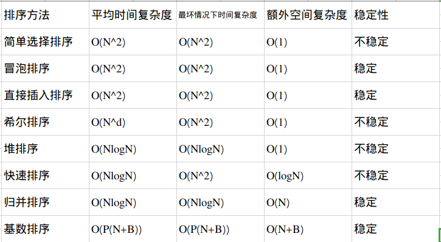

# 排序二
## 快速排序
#### 算法描述
* 分而治之

        void Quicksort(ElementType A[],int N)
        {
            pivot=从A[]中选取一个主元；
            将S={A[]/pivot}将A[]分成2个独立子集，其中一个全都大于pivot，另一个全都小于pivot
            A1={a属于S|a<=pivot}和A2={a属于S|a>=pivot};
            A[]=Quicksort(A1,N1)且{pivot}且Quicksort(A2,N2);
        }
* 什么是快速排序算法的最好情况？
  * 每次正好中分->T(N)=O(NlogN)

#### 选主元
* 令pivot=A[0]?
  * 非常不好的方法：如果数组一开始就顺序，则时间复杂度为T(N)=O(N)+T(N-1)->T(N)=O(N^2)
* 随机选取pivot？
  * 也不好，因为随机选取需要函数rand(),函数rand()也需要时间
* 一般情况下：选取头、中、尾的中位数
* pivot的不同的取法对运行速度有多大影响

        ElementType Median3(ElementType A[],int Left,int Right)
        {
            int Center=(Left+Right)/2;
            if(A[Left]>A[Center])
            {
                Swap(&A[Left],&A[Center])
            }
            if(A[Left]>A[Right])
            {
                Swap(&A[Left],&A[Right])
            }
            if(A[Center]>A[Right])
            {
                Swap(&A[Center],&A[Right])
            }//A[Left]<=A[Center]<=A[Right]
            Swap(&A[Center],&A[Right-1]);//将pivot藏到右边
            return A[Right-1];//返回pivot
        }
#### 子集划分
* 如果有元素正好等于pivot，则停下来交换
#### 小规模数据的处理
* 快速排序的问题
  * 用递归
  * 对小规模的数据（例如N不到100）可能还不如插入排序快
* 解决方案
  * 当递归的数据规模充分小，则停止递归，直接调用简单排序（例如插入排序）
  * 在程序中定义一个Cutoff阀值
#### 算法实现

        void Quicksort(ElementType A[],int Left,int Right)
        {
            if(Cutoff<=Right-Left)
            {
                pivot=Median3(A,Left,Right);
                int i=Left;
                int j=Right;
                for( ; ; )
                {
                    while(A[++i]<pivot)
                    {

                    }
                    while(A[--j]>pivot)
                    {

                    }
                    if(i<j)
                    {
                        Swap(&A[i],&j[j])
                    }
                    else
                    {
                        break;
                    }
                }
                Swap(&A[i],&A[Right-1]);
                Quicksort(A,Left,i-1);
                Quicksort(A,i+1,Right);
            }
            else
            {
                Insertion_Sort(A+Left,Right-Left+1);
            }
        }
        void Quick_sort(ElementType A[],int N)
        {
            Quiicksort(A,0,N-1);
        }

## 表排序
#### 算法描述
* 间接排序
  * 定义一个指针数组为“表”（table）
  
  * 比较A[0(table的值)]和A[1]的(key)大小,交换table(指针)，比较A[2]与A[0]的大小，只有小于前边的数的时候才呼唤位置，否则不换。
  * 结果只交换了指针以及指针所指的那个东西，并没有交换实物（物理意义上的）
  * 如果仅要求按顺序输出，则输出：A[table[0]],A[table[1]],...，A[table[N-1]];
## 物理排序
* N个数字的排列有若干个独立的环组成

* table[0]=3->table[3]=1->table[1]=5->table[5]=0这是一个环
* table[2]=2这是一个环
* table[4]=7->table[7]=6->table[6]=4这是一个环
  * 将table[0]放在Temp=f中,table[0]处的值为3，则table[0]中放的为table[3]中的a，此时table[3]空了出来，table[3]值为1，则table[1]中的d放到table[3]处。
  * 如何判断一个换的结束？if(table[i]==i)
* 复杂度分析
  * 最好情况：初始即有序
  * 最坏情况：
    * 每个环包含2个元素，有[N/2]个环
    * 需要[3N/2]次元素移动

* T=O（m N），m是每个A元素的复制时间

## 桶排序
* 假设有N个学生，他们的成绩是0到100之间的整数（于是有101个不同的成绩值）。如何在线性时间内将学生按成绩排序？
  * 为每个成绩值建造一个桶，count中存放指向空链表的指针，则有101个空链表（101个空的桶）
  * 将第i个学生的成绩（例如88）将此学生的信息插入第88个链表（桶）的表头里

        void Bucket_sort(ElementType A[],int N)
        {
            count[]初始化；
            while(读入一个学生的成绩grade)
            {
                将该学生插入count[grade]链表；
            }
            for(i=0;i<M;i++)
            {
                if(count[i])
                {
                    输出整个count[i]链表；
                }
            }
        }

* 时间复杂度为T(N,M)=O(M+N)(M为桶的数量)
* 但是M>>N时呢？

## 基数排序
* 假设有N=10个整数，每个整数的值在0到999之间（有1000个不同的M的值），此时不能在线性时间内排序
* 输入序列：64,8，216,512,27,729,0,1,343,125
* 用“次位优先”(Least Significant Digit)(pass 1:比较个位数，pass 2:比较十位，pass 3：比较百位)

* T=O(P(N+B)),B为整数进制，P为LSD趟数，元素个数为N
* 复杂度糟糕与否取决于基数有多大，如果B的个数相对小的话，算法接近线性复杂度

## 基数排序还可被用来处理多关键字的排序
* 一副扑克牌是按2中关键字排序的
  * 主关键字为花色，次关键字为面值，在某种花色内部按照面值排序
  * 也可以将次关键字理解为低位（个位），主关键字理解为高位
* 用“主位优先”(Most Significant Digit):
    1. 为花色建四个桶
    1. 每个桶内分别排序，最后合并结果
* 用“次位优先的排序”（Leasr Significant Digit）:
    1. 为面值建13个桶
    1. 将结果合并，然后为花色建4个桶
    2. 将牌放入桶中

## 排序算法的比较
