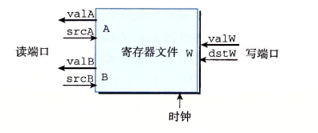
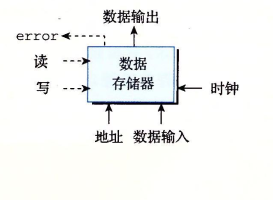

# 逻辑设计和硬件控制语言HCL
* 在硬件设计中，用电子电路来计算对位进行运算的函数，以及在各种寄存器单元中存储位。大多数现代电流技术都是用信号先生的高压电或低压电来表示不同的位值。在当前的技术中，逻辑1使用1.0伏特的高压电来表示的，而逻辑0使用0.0福突然左右的低电压表示的。要实现一个数字系统需要三个主要的组成部分：计算对位进行操作的函数的组合逻辑、存储位的存储器单元，以及控制存储器单元更新的始终信号。

## 逻辑门
* 逻辑门是数字电路的基本计算单元。他们产生的输出，等于他们输出位值的某个布尔函数。c语言中运算符的逻辑门下面是对应的HCL表达式：AND用&&表示，OR用||表示，而NOT用！表示。因为逻辑门只对单个位的数进行操作，而不是整个字。
* 逻辑门总是活动的。一旦一个门的输入变化了，在很短的时间内，输出就会相应地变化.

## 组合电路和HCL布尔表达式
* 间隔很多的逻辑门组成一个王，就能构建计算快，成为组合电路。如何构建这些王有几个限制：
  * 每个逻辑门的输入必须连接到下属选项之一：（1）一个系统输入（称为主输入）（2）某个存储器单元的输出，（3）某个逻辑门的输出
  * 两个或多个逻辑门的输出不能连接在一起。否则它们可能会使线上的信号毛寸，可能会导致一个不合法的电压或电路故障。
  * 这个网必须是无环的，也就是在网中不能有路径经过一系列的门而形成一个回路，这样的回路会导致该网络计算的函数有歧义。
* 图中给出了一个非常有用的简单组合电路的例子。它有两个输入a和b，有唯一的输出eq，当a和b都是1或者都是0时，输出为1.用HCL来写这个王的函数就是：

        bool eq=(a&&b)||(!a&&!b)
* 这段代码简单地定义了位级信号eq，他是输入a和b的函数。从这个例子可以看出HCL使用了c语言风格的语法，'='将一个信号名与一个表达式联系起来。不过桶c不一样，我们不把它看成执行了一次计算并将结果放入内存中某个位置。相反，它只是给表达式一个名字。
* HCL表达式很清楚地表明了组合逻辑电路和c原因中逻辑表达式的对应之处。他们都是用布尔操作来对输入进行计算的函数，值得注意的是，这两种表达计算的方法之间有一下区别：
  * 因为组合电路是由一系列的逻辑门组成，它的属性是输出会持续地相应输入的变化。如果电路的输入变化了，在一定的延迟之后，输出也会相应地变化。相比之下，c表达式知乎在程序执行过程中被遇到时才进行求值。
  * c逻辑表达式有个属性就是他们可能纸杯部分求职。如果一个AND或OR操作的结果只用对第一个参数求职就能确定，那么就不会对第二个参数求值。例如下面的c表达式
        (a&&!a)&&func(b,c)
  * 这里函数func是不会被调动的因为(a&&!a)的值为0.而组合逻辑没有部分求职这条规则，逻辑门只是简单地相应输入的变化。

## 字级的组合电路和HCL整数表达式
* 通过逻辑门组合成打的王，可以构造出能计算更加复杂函数的组合电路。通常，我们设计能对数据字进行操作的电路。有一些位级信号，代表一个整数或一些控制模式。例如，我们的处理器设计将包含有很多子，字的大小的范围为4位到64位，代表整数、地址、指令代码和寄存器标识符
* 执行字级计算的组合电路根据输入字的各个位，用逻辑门来计算输出字的各个位。
* 在HCL中，我们将所有字级的信号都声明为int，不指定紫的大小。这样做是为了简单。在全功能的硬件描述语言中，每个字都可以声明为有特定的位数。HCL允许比较字是否相等，在画字级电路的时候，我们用1中等粗度的线来携带字的每个位的线路，二用虚线来表示布尔信号结束。

## 存储器和时钟
* 组合电路从本质上讲，不存储任何信息。相反，他们只是简单地相应输入信号，产生等于输入的某个函数的输出。为了产生时序电路，也就是有状态并且在这个状态上进行计算的系统，我们必须引入按位存储信息的设备。存储设备都是有同一个始终控制的，始终是一个周期性信号，决定什么时候要把心智加载到设备中。考虑两类存储设备：
  * 时钟寄存器存储单个位或字。时钟信号控制寄存器加载输入值。
  * 随机访问存储器存储多个字，用地址来选择该读或该写哪个字。随机访问存储器的例子包括：（1）处理器的虚拟内存系统，硬件恶化操作系统软件结合起来时处理器可以再很大的地址空间内访问任意的字：（2）寄存器文件有15个程序寄存器。
* 正如我们看到那样，在说道硬件和机器级编程时，“寄存器”这个词是两个有细微差别的事情。在硬件中，寄存器直接将它的输入和输入连接到电路的其他部分。在机器级编程中，寄存器通常代表的是CPU中为数不多的可寻址的字，这里的地址是寄存器ID。这写字通常刚都存在寄存器文件中，虽然我们会看到硬件有时可以直接将一个字从一个指令传送到另一个指令，以避免先写寄存器文件再读出来的延迟。需要避免其一是，我们会分别称呼这两类寄存器为“硬件寄存器”和“程序寄存器”
* 大多数时候，寄存器都保持在稳定状态，产生的输出等于它当前的状态。信号沿着寄存器前面的组合逻辑传播，这时，产生了一个新的寄存器输入，但只要时钟是低电位的，寄存器的输出就仍然保持不变。党始终变成高电位的时候，输出信号就加载到寄存器中，成为下一个状态y，知道下一个始终上升沿，这个状态就已知是寄存器的新输出。关键是寄存器是作为电路不同部分中的组合逻辑之间的屏障。每当每个始终到达上升沿时，值才会从寄存器的输入传送到输出。我们的Y86处理器会使用始终寄存器保存程序计数器（PC）、条件码（CC）和程序状态（Stat）。
* 寄存器文件有两个度端口（A和B）还有一个写端口。这样一个多端口随机访问存储器允许同时进行多个渡河写操作。图中所示的寄存器文件中，电路可以读两个程序寄存器的值，同时更新第三个寄存器状态。每个端口都有一个地址输入，表明该选择哪个程序寄存器，另外还有一个数据输入或对应改程序寄存器的输入值。

* 虽然寄存器文件不是组合电路，因为它有内部存储。不过，在我们的视线中，从寄存器文件读数据就好像它是一个以地址为输入、数据为输出的一个组合逻辑块。当srcA和srcB被射程某个寄存器ID时，在一段延迟之后，存储在相应程序寄存器的值就会出现在valA或VAlb上。例如，将srcA设为3，就会独处程序寄存器%rbx的值，然后这个值就会出现在输出valA上。
* 向寄存器文件写入字是由始终信号控制的，控制方式类似于将值加载到时钟寄存器。每次时钟上升时，输入calW上的值就会被写入输出dstW上的寄存器ID知识的程序寄存器。当dstW设为特殊的ID值0xF时，不会写任何程序计数器。由于寄存器文件即可以读也可以写，一个很自然的问题就是如果我们试图同时独活蟹同一个寄存器会发生什么？答案简单明了：如果更新一个寄存器，同时在读端口上用同一个寄存器ID，我们会看到一个从旧值到新值的变化。当我们把这个寄存器文件加入到处理器设计中，我们保证会考虑到这个属性的。处理器有一个随机访问存储器来存储程序数据。

* 这个内存有一个地址输入，一个写的数据输入，以及一个读的数据输出。同寄存器文件一样，从内存中读的操作方式类似于组合逻辑：如果我们在输入address上提供一个地址，并将write控制信号设置为0，那么在经过一些延迟之后，存储在那个低智商的值就会出现在输出data上，如果地址超出了范围，error信号会设置为1，否则就设置为0.写内存是由时钟控制的：我们将address设置为期望的地址，将data in设置为期望的值，而write设置为1，然后我们控制时钟是，只要地址适合法的，就会更新内存中指定的位置。对于读操作来说，如果地址是不合法的，error信号会被设置为1.这个信号是由组合逻辑产生的，因为所需要的便捷检查纯粹就是地址输入的函数，不涉及保存任何状态。
* 我们的处理器还包括另外一个只读存储器，用来读指令。在大多数实际系统中，这两个存储器被合并为一个具有双端口的存储器：一个用来读指令，另一个用来度或者写数据。
